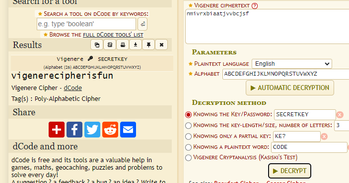
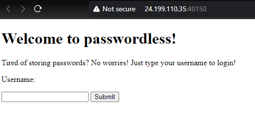
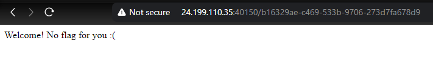
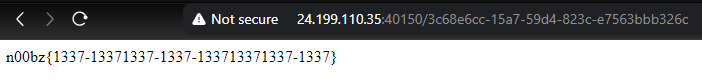
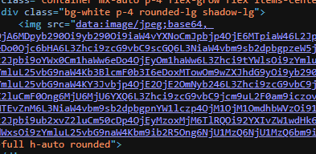

<script type="text/javascript" src="https://cdn.mathjax.org/mathjax/latest/MathJax.js?config=TeX-AMS-MML_HTMLorMML"></script>


Well, this was a blessing in disguise as it was made made for n00bz by n00bz.

```bash
Authors: AbuCTF, MrRobot, SHL, PattuSai
```

## Cryptography

### RSA

The cryptography category is incomplete without RSA. So here is a simple RSA challenge. Have fun! Author: `noob_abhinav`

**Attachments**

- [encryption.txt](https://static.n00bzunit3d.xyz/Crypto/RSA/encryption.txt)

Ah, the OG RSA challenge. 

```bash
e = 3
n = 135112325288715136727832177735512070625083219670480717841817583343851445454356579794543601926517886432778754079508684454122465776544049537510760149616899986522216930847357907483054348419798542025184280105958211364798924985051999921354369017984140216806642244876998054533895072842602131552047667500910960834243
c = 13037717184940851534440408074902031173938827302834506159512256813794613267487160058287930781080450199371859916605839773796744179698270340378901298046506802163106509143441799583051647999737073025726173300915916758770511497524353491642840238968166849681827669150543335788616727518429916536945395813
```

This is a straight forward challenge, of course you can take these values and paste it in any RSA decoders like `dcode` or `RsaCtfTool` and it would work. But let’s study the theory behind the reason that we’re able to crack the cipher. 

> Don’t Rush The Process, Trust The Process.
> 

Here’s an example with the `RsaCtfTool`.

```bash
└─$ python3 RsaCtfTool.py -n 135112325288715136727832177735512070625083219670480717841817583343851445454356579794543601926517886432778754079508684454122465776544049537510760149616899986522216930847357907483054348419798542025184280105958211364798924985051999921354369017984140216806642244876998054533895072842602131552047667500910960834243 
-e 3 --decrypt 13037717184940851534440408074902031173938827302834506159512256813794613267487160058287930781080450199371859916605839773796744179698270340378901298046506802163106509143441799583051647999737073025726173300915916758770511497524353491642840238968166849681827669150543335788616727518429916536945395813

Decrypted data :
HEX : 0x6e3030627a7b6372797074305f31735f316e63306d706c3374335f773174683075745f72733421217d
INT (big endian) : 235360648501923597413504426673122110620436456645077837051697081536135487875222175025616363200782717
INT (little endian) : 267274803801739728615674650006248742190143184448285803664400617962080516309180649444183969553723502
utf-8 : n00bz{crypt0_1s_1nc0mpl3t3_w1th0ut_rs4!!}
STR : b'n00bz{crypt0_1s_1nc0mpl3t3_w1th0ut_rs4!!}'
```

Note: I deep dive into theoretical mathematics and cryptography. If you good, skip to the next challenge.

Okay, this challenge involves the vulnerability in the exponent being a small number. We call this the *small public exponent attack*.

In RSA encryption, the security comes from the difficulty of reversing the encryption process without the private key. The process is based on modular arithmetic, where a message m is raised to the power of an exponent e and then reduced modulo n. The encryption formula is:

$$
c=m^emodn
$$

Here, c is the ciphertext, e is the public exponent, and n is the modulus, which is a product of two large prime numbers.

When e is small, like e = 3 , and the message m is also small, something unusual can happen.

This is because, In typical RSA encryption, m^e should be much larger than n, so that the operation m^emodn effectively "`wraps around`" [I’ll come back on what wraps around really means] and gives a number within the range of 0 to n -1. This wrapping ensures that the original message $m$ cannot be easily derived from the ciphertext c.

However, if the message m is small, then m^e might still be smaller than . For example, if m is small and e =3, then:

$$
m^3 < n
$$

In this case, the operation m^3 modn does nothing because m^e is already smaller than n. Therefore, the ciphertext c will just be m^e without any reduction. So, we can write:

$$
c = m^3
$$

So if an attacker intercepts this ciphertext c , they can easily recover the original message m by taking the cube root of c :

$$
m = \sqrt[3]{c}
$$

This works because the ciphertext is just m^e, and taking the cube root of m^e gives back m. No special mathematical tricks or complex calculations are needed—just a simple cube root operation.

<aside>
💡 The term "wraps around" refers to how modular arithmetic works. When we compute m^emodn, we are essentially reducing the number m^e to fit within the range from 0 to n -1.

</aside>

But funnily, there is a unique case for this, even thought what happens when m^e equals to n, I’ll leave this as an exercise for the reader to think about LOL.


`Exploit Time`

```python
import gmpy2

e = 3
n = 135112325288715136727832177735512070625083219670480717841817583343851445454356579794543601926517886432778754079508684454122465776544049537510760149616899986522216930847357907483054348419798542025184280105958211364798924985051999921354369017984140216806642244876998054533895072842602131552047667500910960834243
c = 13037717184940851534440408074902031173938827302834506159512256813794613267487160058287930781080450199371859916605839773796744179698270340378901298046506802163106509143441799583051647999737073025726173300915916758770511497524353491642840238968166849681827669150543335788616727518429916536945395813

m = gmpy2.iroot(c, e)[0]
mInt = int(m)

mBytes = mInt.to_bytes((mInt.bit_length() + 7) // 8, byteorder='big')
flag = mBytes.decode('utf-8')

print("Flag:", flag)
```

Output:

```python
└─$ python3 solve.py
Flag: n00bz{crypt0_1s_1nc0mpl3t3_w1th0ut_rs4!!}
```

Flag: `n00bz{crypt0_1s_1nc0mpl3t3_w1th0ut_rs4!!}`

### **Vinegar**

Can you decode this message? Note: Wrap the decrypted text in n00bz{}. Author: `noob_abhinav`

**Attachments**

- [enc.txt](https://static.n00bzunit3d.xyz/Crypto/Vinegar/enc.txt)

```python
Encrypted flag: nmivrxbiaatjvvbcjsf
Key: secretkey
```

We’ve been given the ciphertext and key, and this totally points to **`Vigenere` Cipher.**


Head on to `dCode` to decode it.



Flag: `n00bz{vigenerecipherisfun}`

### **Vinegar 2**

Never limit yourself to only alphabets! Author: `NoobMaster`

**Attachments**

- [chall.py](https://static.n00bzunit3d.xyz/Crypto/Vinegar2/chall.py)
- [enc.txt](https://static.n00bzunit3d.xyz/Crypto/Vinegar2/enc.txt)

```python
alphanumerical = 'abcdefghijklmnopqrstuvwxyzABCDEFGHIJKLMNOPQRSTUVWXYZ1234567890!@#$%^&*(){}_?'
matrix = []
for i in alphanumerical:
        matrix.append([i])

idx=0
for i in alphanumerical:
        matrix[idx][0] = (alphanumerical[idx:len(alphanumerical)]+alphanumerical[0:idx])
        idx += 1

flag=open('../src/flag.txt').read().strip()
key='5up3r_s3cr3t_k3y_f0r_1337h4x0rs_r1gh7?'
assert len(key)==len(flag)
flag_arr = []
key_arr = []
enc_arr=[]
for y in flag:
        for i in range(len(alphanumerical)):
                if matrix[i][0][0]==y:
                        flag_arr.append(i)

for y in key:
        for i in range(len(alphanumerical)):
                if matrix[i][0][0]==y:
                        key_arr.append(i)

for i in range(len(flag)):
        enc_arr.append(matrix[flag_arr[i]][0][key_arr[i]])
encrypted=''.join(enc_arr)
f = open('enc.txt','w')
f.write(encrypted)
```

```python
└─$ cat enc.txt
*fa4Q(}$ryHGswGPYhOC{C{1)&_vOpHpc2r0({
```

So, we’ve been given an another implementation of the **`Vigenere` Cipher.** But this time around `dCode` or `CyberChef` won’t be able to decode it since we have a much larger character set and hence the matrix is alphanumeric  when compared to the traditional alphabetic matrices that `dCode` uses. 

Another thing to note is that the key is the same length of the ciphertext and it includes special characters and all of that.

Key:      `5up3r_s3cr3t_k3y_f0r_1337h4x0rs_r1gh7?`

Cipher: `*fa4Q(}$ryHGswGPYhOC{C{1)&_vOpHpc2r0({`

- For each character in the flag and key, the code finds the index of that character in the `alphanumerical` string. This index is stored in `flag_arr` and `key_arr`.
- **Encryption:**
    - The encryption is performed by iterating over each character in the flag and key simultaneously. For each character in the flag, the code finds the corresponding row in the matrix using `flag_arr` (the index of the flag character).
    - Then, it uses the corresponding index from `key_arr` to find the character in that row, which becomes part of the encrypted message.
    - The resulting encrypted message is stored in `enc.txt`.

Now, we write a script that reverses the encryption by using the key to map the encrypted characters back to the original characters in the flag.

```python
alphanumerical = 'abcdefghijklmnopqrstuvwxyzABCDEFGHIJKLMNOPQRSTUVWXYZ1234567890!@#$%^&*(){}_?'
matrix = []

for i in alphanumerical:
    matrix.append([i])

for idx, i in enumerate(alphanumerical):
    matrix[idx][0] = (alphanumerical[idx:] + alphanumerical[:idx])

cipher = '*fa4Q(}$ryHGswGPYhOC{C{1)&_vOpHpc2r0({'
key = '5up3r_s3cr3t_k3y_f0r_1337h4x0rs_r1gh7?'

keyIndices = []
for y in key:
    for i in range(len(alphanumerical)):
        if matrix[i][0][0] == y:
            keyIndices.append(i)

decrypted = []
for i, encChar in enumerate(cipher):
    keyIDX = keyIndices[i]
    for j, char in enumerate(matrix[keyIDX][0]):
        if char == encChar:
            decrypted.append(alphanumerical[j])
            break

flag = ''.join(decrypted)
print(flag)
```

Flag: `n00bz{4lph4num3r1c4l_1s_n0t_4_pr0bl3m}`

### Random

I hid my password behind an impressive sorting machine. The machine is very luck based, or **is it**?!?!?!? Author: Connor Chang

**Attachments:**

- [server.cpp](https://static.n00bzunit3d.xyz/Crypto/Random/server.cpp)

```cpp
#include<chrono>
#include<cstdlib>
#include<iostream>
#include<algorithm>
#include<string>
#include<fstream>
#include<thread>
#include<map>
using namespace std;

bool amazingcustomsortingalgorithm(string s) {
    int n = s.size();
    for (int i = 0; i < 69; i++) {
        cout << s << endl;
        bool good = true;
        for (int i = 0; i < n - 1; i++)
            good &= s[i] <= s[i + 1];

        if (good)
            return true;

        random_shuffle(s.begin(), s.end());

        this_thread::sleep_for(chrono::milliseconds(500));
    }

    return false;
}

int main() {
    string s;
    getline(cin, s);

    map<char, int> counts;
    for (char c : s) {
        if (counts[c]) {
            cout << "no repeating letters allowed passed this machine" << endl;
            return 1;
        }
        counts[c]++;
    }

    if (s.size() < 10) {
        cout << "this machine will only process worthy strings" << endl;
        return 1;
    }

    if (s.size() == 69) {
        cout << "a very worthy string" << endl;
        cout << "i'll give you a clue'" << endl;
        cout << "just because something says it's random mean it actually is" << endl;
        return 69;
    }

    random_shuffle(s.begin(), s.end());

    if (amazingcustomsortingalgorithm(s)) {
        ifstream fin("flag.txt");
        string flag;
        fin >> flag;
        cout << flag << endl;
    }
    else {
        cout << "UNWORTHY USER DETECTED" << endl;
    }
}
```


```cpp
└─$ nc challs.n00bzunit3d.xyz 10208
4761058239
0123456789
n00bz{5up3r_dup3r_ultr4_54f3_p455w0rd_1fa89f63a437}
```

Flag: `n00bz{5up3r_dup3r_ultr4_54f3_p455w0rd_1fa89f63a437}`

## Web

### **Passwordless**

Tired of storing passwords? No worries! This super secure website is passwordless! Author: `NoobMaster`

**Attachments**

- [app.py](https://static.n00bzunit3d.xyz/Web/Passwordless/app.py)
- https://24.199.110.35:40150/

```python
#!/usr/bin/env python3
from flask import Flask, request, redirect, render_template, render_template_string
import subprocess
import urllib
import uuid
global leet

app = Flask(__name__)
flag = open('/flag.txt').read()
leet=uuid.UUID('13371337-1337-1337-1337-133713371337')

@app.route('/',methods=['GET','POST'])
def main():
    global username
    if request.method == 'GET':
        return render_template('index.html')
    elif request.method == 'POST':
        username = request.values['username']
        if username == 'admin123':
            return 'Stop trying to act like you are the admin!'
        uid = uuid.uuid5(leet,username) # super secure!
        return redirect(f'/{uid}')

@app.route('/<uid>')
def user_page(uid):
    if uid != str(uuid.uuid5(leet,'admin123')):
        return f'Welcome! No flag for you :('
    else:
        return flag

if __name__ == '__main__':
    app.run(host='0.0.0.0', port=1337)
```



Just a simple website that took in the username `admin123` and password to log the user in.

```python
if username == 'admin123':
            return 'Stop trying to act like you are the admin!'
        uid = uuid.uuid5(leet,username) # super secure!
        return redirect(f'/{uid}')
```

In this part of the flask code, you see that the server accepts the username `admin123` and returns the strings “Stop trying to act like you are the admin!” and for other usernames then there is a page route that redirects to `/{uid}` .



<aside>
💡 The vulnerability lies in the use of UUID version 5 (`uuid.uuid5`). UUID version 5 generates a UUID based on a namespace (`leet` in this case) and a name (`username`). Since both the namespace and the target name (`'admin123'`) are known, an attacker can calculate the correct UUID corresponding to `'admin123'`.

</aside>

Here is a simple script that calculate the UUID of the admin123 user.

```python
import uuid

leet = uuid.UUID('13371337-1337-1337-1337-133713371337')
target = 'admin123'

UUID = uuid.uuid5(leet, target)
print(UUID)
```

```python
└─$ python3 generate.py
3c68e6cc-15a7-59d4-823c-e7563bbb326c
```

Now, paste this UUID in the URL and get the flag.



Flag: `n00bz{1337-13371337-1337-133713371337-1337}`

### **Focus on yourSELF**

Have you focused on yourself recently? Author: `NoobHacker`

**Attachments**

- [docker-compose.yaml](https://static.n00bzunit3d.xyz/Web/Focus-on-yourSELF/docker-compose.yaml)

So, first of all I’m not a web guy, but I gave it a try anyways.

```python
└─$ cat docker-compose.yaml
# CHANGE THE FLAG WHEN HANDING THIS OUT TO PLAYERS

services:
  web:
    build: .
    ports:
      - "4000:1337"
    environment:
      - FLAG="n00bz{f4k3_fl4g_f0r_t3st1ng}"
```

We were also given a web instance, 

**Instance Info**

[Link to the Challenge](https://7a084670-35e8-406a-9247-06707fcf46d5.challs.n00bzunit3d.xyz:8080/)

You see the SELF capitalized in the title of the challenge, that and the flag in the environment in the `docker-compose.yaml` file lead me to conclude that the flag is located in the environment of the site.

A quick google on where the environment variables get stores, gives me `/proc/self/environ`. This also means the site is vulnerable to `LFI [Local File Inclusion]` . Let’s check if it’s actually vulnerable to LFI.

Going to the `view` page, we see an image with the URL, 

[Image](https://7a084670-35e8-406a-9247-06707fcf46d5.challs.n00bzunit3d.xyz:8080/view?image=nature.jpeg)

so instead of `/view?image=nature.jpeg` let’s do `/view?image=../../../../etc/passwd` .

It didn’t print out the detail then and there, going to the source.




We see a huge `base64` string. 


Turns out it actually is the `etc/passwd` file. Crazy. Now let’s find out the environment variables.

`/view?image=../../../../proc/self/environ` and decoding the base64, we get the flag.

```python
PATH=/usr/local/bin:/usr/local/sbin:/usr/local/bin:/usr/sbin:/usr/bin:/sbin:/bin␀
HOSTNAME=bed1b2061841␀FLAG=n00bz{Th3_3nv1r0nm3nt_det3rmine5_4h3_S3lF_d542cc29d35c}
␀LANG=C.UTF-8␀GPG_KEY=A035C8C19219BA821ECEA86B64E628F8D684696D␀
PYTHON_VERSION=3.10.14␀PYTHON_PIP_VERSION=23.0.1␀PYTHON_SETUPTOOLS_VERSION=65.5.1␀
PYTHON_GET_PIP_URL=https://github.com/pypa/get-pip/raw/66d8a0f637083e2c3ddffc0cb1e65ce126afb856/public/get-pip.py␀PYTHON_GET_PIP_SHA256=6fb7b781206356f45ad79efbb19322caa6c2a5ad39092d0d44d0fec94117e118␀HOME=/home/chall␀
```

Flag: `n00bz{Th3_3nv1r0nm3nt_det3rmine5_4h3_S3lF_d542cc29d35c}`

## Misc

### **Sanity Check**

Welcome to n00bzCTF 2024! Join our [discord](https://discord.gg/Kze7sjpgf7) server to get the flag! Author: `n00bzUnit3d`

Join discord and scroll into #Announcements.

Flag: `n00bz{w3lc0m3_t0_n00bzCTF2024!}`

### **Addition**

My little brother is learning math, can you show him how to do some addition problems? Author: Connor Chang

**Attachments**

- [server.py](https://static.n00bzunit3d.xyz/Misc/Addition/server.py)
- nc 24.199.110.35 42189

```python
import time
import random

questions = int(input("how many questions do you want to answer? "))

for i in range(questions):
    a = random.randint(0, 10)
    b = random.randint(0, 10)

    yourans = int(input("what is " + str(a) + ' + ' + str(b) + ' = '))

    print("calculating")

    totaltime = pow(2, i)

    print('.')
    time.sleep(totaltime / 3)
    print('.')
    time.sleep(totaltime / 3)
    print('.')
    time.sleep(totaltime / 3)

    if yourans != a + b:
        print("You made my little brother cry 😭")
        exit(69)

f = open('/flag.txt', 'r')
flag = f.read()
print(flag[:questions])
```

In the server code, it does additions and checks the answer, but `sighs`

To determine how long it would take for the entire script to run, let's break it down step-by-step:


<aside>
💡 It would take approximately, 2.2 million years to complete all questions !

</aside>

But start playing around with it, try inputting different numbers in the instance, remember there’s not just positive numbers in the world. Once you figure it out. Flag!

- **Negative or Zero Questions**:
    - If you enter `1` or `0`, the `range(questions)` loop won’t execute any iterations. This is because `range(-1)` and `range(0)` result in an empty sequence. As a result, no questions are processed, and no delays are introduced.
- **Immediate Access to the Flag**:
    - Since no questions are processed, the code immediately proceeds to open the `/flag.txt` file and print the flag.
    - In the specific case of `1`, the loop effectively does nothing, and the script directly accesses the flag file.


Truly a big-brain moment LOL.

```python
└─$ nc 24.199.110.35 42189
how many questions do you want to answer? -1
n00bz{m4th_15nt_4ll_4b0ut_3qu4t10n5}
```

Flag: `n00bz{m4th_15nt_4ll_4b0ut_3qu4t10n5}`

### **Agree**

I hope you like our Terms of Service and Privacy Policy of our website! Author: `NoobMaster`

Can you believe I opened a ticket to solve this challenge ?! LOL.

Just visit both these URLs

[n00bzCTF/TOS](https://ctf.n00bzunit3d.xyz/tos)

[n00bzCTF/PRIVACY](https://ctf.n00bzunit3d.xyz/privacy)

Thanks for agreeing to our Terms of Service! Here's 1/2 of your flag: n00bz{Terms_0f_Serv1c3s_

This is our Privacy Policy! Here's 2/2 of your flag: 4nd_pr1v4cy_p0l1cy_6f3a4d}

Flag: `n00bz{Terms_0f_Serv1c3s_4nd_pr1v4cy_p0l1cy_6f3a4d}`
