Hello, well I thought it would be great to document about hosting an CTF event. We `H7Tex` are planning to host `H7CTF` around mid-September, so here goes. I wanted to document about how the infra looks, how to set it up and so on, as to make it easier for people in the CTF community to host a CTF of their own. As of 25th July, I know literally nothing about anything. Got this wild idea to host an International CTF, and just went with it. Now, we `H7Tex` are neck deep into the preparation of the CTF. Good luck to us and all the participants.

This is the story of how we pulled off an International CTF for about 2000 hackers using just 8 GB of RAM and 4 vCPUs, managing to keep it all running with zero downtime—a crazy challenge that showed what we could really do together!

### Goofing Around

So, the initial plan was to completely host on `CTFd`, so that they handle all the hosting and all infrastructure related stuff. Here is the pricing of hosting on `CTFd`. 


Well, as university students with a hole in our pockets. We had to go for the $50 dollar option. Even asked an opinion of a fellow mate, about the capacity of the CTFd server, they said it could handle about 650 participants. So, I was cool with it. Then plans changed as the expected number of players grew to 1500. Wrote a query to CTFd about the capacity of all the hosting plans. Then it hit.


If we were to go with the original plan, then we would’ve been so cooked. Well, good thing was, we got to know about Google Cloud and the free `$300 GCP` credits. So now to plan stands here. 

Hosting on Google Cloud with VMs for both CTF Infra and Challs individually. Got to know about the specs needed from another dude. Here’s the summary, as I’m too lazy to list all of that in order.

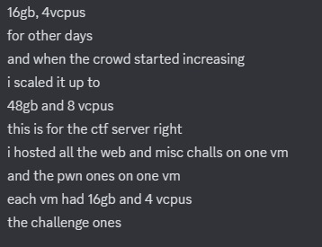

Shout-Out to **`$h1kh4r`** for the much needed tips. Dude hosted an International CTF with little to no help while being in 10th grade ! Props to him and the organizing team of `OSCTF`.

Also, we will be using Docker to containerize the challengers to make it easy to host and manage them. Also require domain name with A records configured and so on to point to the servers.

Finally, `Cloud-Flare` along with rate-limiting to prevent DDOS and attacks against the server.

Let’s dive a bit into Docker and it’s usages to get familiar with it.

Note:  I use a Windows 10 and last time I checked, Docker wasn’t compatible with mine. So cooked before I even start.

[Install Docker Desktop on Windows](https://docs.docker.com/desktop/install/windows-install/)

Going on to the Docker documentation,

Windows 10 64-bit:

- We recommend Home or Pro 22H2 (build 19045) or higher, or Enterprise or Education 22H2 (build 19045) or higher.

Which my machine satisfies. Good.

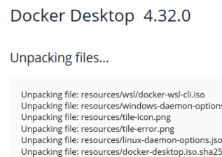

Woah, it is actually happening. And it works !

Also, don’t forget to integrate Docker with WSL2. If you do use WSL2.


Check it’s working and run a test container.

```bash
┌──(abu㉿Abuntu)-[~]
└─$ docker --version
Docker version 27.0.3, build 7d4bcd8
root@Abuntu:~# docker run hello-world
```

Now, it’s time to watch some tutorials on Docker and Google Cloud. Resources are given below.


Proud moment right here LOL. Well, now that I got an idea any all these things.


 Let’s build a sample web application to solidify our learning. Also, while we’re at it, why not build a web challenge at it.

```bash
┌──(abu㉿Abuntu)-[/mnt/c/Documents4/DockerJWT/backend]
└─$ npm install bcrypt cookie-parser cors dotenv express zod jsonwebtoken mongoose resend
```

So, it’s a JWT-based authentication put together in the `MERN` stack.

More Dev-Dependencies and Typescript.

```bash
┌──(abu㉿Abuntu)-[/mnt/c/Documents4/DockerJWT/backend]
└─$ npm install -D @types/bcrypt @types/cookie-parser @types/cors @types/express @types/jsonwebtokens ts-node-dev typescript
└─$ npx tsc --init
```

Setting up MongoDB Compass with CLI.

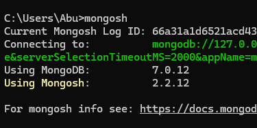

Ran into the first barricade, seems like the WSL2 client isn’t connecting to the MongoDB server running in Windows. Troubleshooting time.

```bash
sudo apt install mongodb
sudo mkdir -p /data/db
sudo chown -R `id -u` /data/db
mongod --dbpath /data/db # Starts the MongoDB server in WSL2
```

And finally, 

```bash
──(abu㉿Abuntu)-[/mnt/c/Documents4/DockerJWT/backend]
└─$ npm run dev

> backend@1.0.0 dev
> ts-node-dev --files src/index.ts

[INFO] 14:06:44 ts-node-dev ver. 2.0.0 (using ts-node ver. 10.9.2, typescript ver. 5.5.4)
The server is up and running on Port 4004
Connecting to DB...
Successfully connected to DB
```

Also, to run the `mongod`  in the background. We use `nohup`.

```bash
┌──(abu㉿Abuntu)-[/mnt/c/Documents4/DockerJWT]
└─$ sudo mkdir -p /var/log/mongodb
[sudo] password for abu:

┌──(abu㉿Abuntu)-[/mnt/c/Documents4/DockerJWT]
└─$ sudo chown $(whoami) /var/log/mongodb

┌──(abu㉿Abuntu)-[/mnt/c/Documents4/DockerJWT]
└─$ sudo chmod 755 /var/log/mongodb

┌──(abu㉿Abuntu)-[/mnt/c/Documents4/DockerJWT]
└─$ sudo nohup mongod --dbpath /data/db > /var/log/mongodb/mongod.log 2>&1 &
[3] 3777

┌──(abu㉿Abuntu)-[/mnt/c/Documents4/DockerJWT]
└─$ ps aux | grep mongod
root        3733  0.0  0.1  17128  6336 pts/0    T    14:14   0:00 sudo nohup mongod --dbpath /data/db
root        3748  0.0  0.1  17128  6520 pts/0    T    14:14   0:00 sudo nohup mongod --dbpath /data/db
root        3777  0.0  0.1  17276  6384 pts/0    S    14:15   0:00 sudo nohup mongod --dbpath /data/db
root        3778  0.0  0.0  17276   992 pts/4    Ss+  14:15   0:00 sudo nohup mongod --dbpath /data/db
root        3779 32.6  3.3 2608868 131064 pts/4  Sl   14:15   0:01 mongod --dbpath /data/db
abu         3824  0.0  0.0   6428  1964 pts/0    S+   14:15   0:00 grep --color=auto mongod
```

Get IP address of the WSL2 client.

```bash
ip addr show eth0 | grep inet | awk '{ print $2 }' | cut -d/ -f1
```

Also, after a long trial and error methods, we added the config file for MongoDB which necessary configurations like allowing port entry and so on in the `/etc/mongod.conf` file.

But, there’s a simple solution to all this, just open up MongoDB compass on the Windows machine, get the IP of the WSL2 instance with `hostname -I` and make a new connection with 

`mongodb://<WSL_IP>:27017` and Voila, you are connected to the MongoDB server from WSL2.

https://github.com/nvm-sh/nvm

Now, I have passed on the creation of the challenge to `@MrRobot` . 

Well, let’s create a sample `pwn` challenge and containerize with Docker, and start a `netcat` listener to the challenge, so we can actually connect to it and exploit the buffer overflow, getting the flag.

```bash
/mnt/c/Documents4/Pwn/
├── BufPwn
│   ├── Dockerfile
│   ├── chall.c
│   └── flag.txt
├── OvrPwn
│   ├── Dockerfile
│   ├── overflow.c
│   └── flag.txt
└── docker-compose.yml

```

Here what the `Dockerfile` for `BufPwn` looks like.

```docker
FROM debian:latest

RUN apt-get update && apt-get install -y gcc socat

COPY chall.c /pwn/chall.c
COPY flag.txt /pwn/flag.txt

RUN gcc -o /pwn/chall /pwn/chall.c -fno-stack-protector -z execstack -no-pie

CMD ["socat", "tcp-l:9001,reuseaddr,fork", "exec:/pwn/chall,stderr"]

```

And Finally, the docker-compose utility helps us to manage multiple docker instance and run as many containers easily.

```docker
version: '3.8'

services:
  bufpwn:
    build:
      context: ./BufPwn
    container_name: bufpwn
    ports:
      - "9001:9001"

  ovrpwn:
    build:
      context: ./OvrPwn
    container_name: ovrpwn
    ports:
      - "9002:9002"
```

Ensure, Docker is properly integrated with the WSL2 Instance.

```bash
┌──(abu㉿Abuntu)-[/mnt/c/Documents4/Pwn]
└─$ docker-compose --version
Docker Compose version v2.28.1-desktop.1

┌──(abu㉿Abuntu)-[/mnt/c/Documents4/Pwn]
└─$ docker --version
Docker version 27.0.3, build 7d4bcd8
```

Now, build the docker images.

```bash
┌──(abu㉿Abuntu)-[/mnt/c/Documents4/Pwn]
└─$ docker-compose build
WARN[0000] /mnt/c/Documents4/Pwn/docker-compose.yml: `version` is obsolete
[+] Building 86.1s (18/18) FINISHED                                                                             docker:default
<>
```

Finally, Run the containers.

```bash
└─$ docker-compose up
WARN[0000] /mnt/c/Documents4/Pwn/docker-compose.yml: `version` is obsolete
[+] Running 3/3
 ✔ Network pwn_default  Created                                                                                           0.1s
 ✔ Container bufpwn     Created                                                                                           0.3s
 ✔ Container ovrpwn     Created                                                                                           0.3s
Attaching to bufpwn, ovrpwn
```

To, verify the running of the containers.

```bash
PS C:\Users\Abu> docker ps
CONTAINER ID   IMAGE        COMMAND                  CREATED              STATUS              PORTS                    NAMES
5617b16633ec   pwn-bufpwn   "socat tcp-l:9001,re…"   About a minute ago   Up About a minute   0.0.0.0:9001->9001/tcp   bufpwn
be20a7fbe725   pwn-ovrpwn   "socat tcp-l:9002,re…"   About a minute ago   Up About a minute   0.0.0.0:9002->9002/tcp   ovrpwn
```

Let’s try connecting to the instances from Ubuntu WSL2.

```bash
abu@Abuntu:/root$ nc localhost 9001

Welcome to heap1!
I put my data on the heap

abu@Abuntu:/root$ nc localhost 9002
Enter the address in hex to jump to, excluding '0x': 
```

Seems, like both the challenges are working perfectly. Let’s run the exploits on both of them to get the flag and these are pretty volume heavy, but I know fundamentally, hosting without docker would take up even more space than this.

```bash
abu@Abuntu:/root$ sudo docker images
REPOSITORY    TAG       IMAGE ID       CREATED         SIZE
pwn-ovrpwn    latest    cff435b0acc6   9 minutes ago   403MB
pwn-bufpwn    latest    04a3ec641f65   9 minutes ago   403MB
```

And I’m not able to get the flags due to god knows what reason. My instincts point highly in favor of  Skill-Issue LOL. Then stop and remove the image volumes.

```bash
┌──(abu㉿Abuntu)-[/mnt/c/Documents4/Pwn]
└─$ docker-compose down -v
WARN[0000] /mnt/c/Documents4/Pwn/docker-compose.yml: `version` is obsolete
[+] Running 3/3
 ✔ Container bufpwn     Removed                                                                                           1.0s
 ✔ Container ovrpwn     Removed                                                                                           0.8s
 ✔ Network pwn_default  Removed
```

### Plot Twist

It was a normal Sunday, I was planning on bring the CTFd down locally and play with it, even hosting some sample challenges and figuring out how things worked. It so happened, the `DeadSec CTF` was going on at the time and it had a massive participation of almost 3k people !

So I messaged `@Buckley`, shout-out to him. And got a mental breakdown. Here’s a peek into how the convo went.


This crazy guy, finished and fixing stuff mid-CTF! Well, I’m nowhere close to this level of expertise. They had used `Autopilot with GKE` to host the event. (I don’t even know that that means)

Here are some points he put out.

<aside>
💡 There are three non-default things that you should do to ctfd. one is make sure you set up redis, next is make sure you can have multiple worker threads/processes. And then third, and I'm not sure how big of a deal this one actually is, but I would not server large file downloads from ctfd directly. Offload large files to something external.

And then, one thing that may have been an issue is that I wrote a ctfd plugin last year, and I think that might have slowed down the ctfd app since it made blocking api calls while it was spinning challenges up and down.

Oh also email is awful. I don't know how if you plan on supporting email or not...

This event is the first time I touched email in years lol

Last year we didn't do email verification

</aside>

Also, he gave some really good links that I could refer.

[How to run a CTF that survives the first 5 minutes](https://medium.com/@sam.calamos/how-to-run-a-ctf-that-survives-the-first-5-minutes-fded87d26d53)

[Configuration | CTFd Docs](https://docs.ctfd.io/docs/deployment/configuration/)

And I cooked up some more links, while reading these.

[Creating Scalable CTF Infrastructure on Google Cloud Platform with Kubernetes and App Engine](https://medium.com/@sam.calamos/creating-scalable-ctf-infrastructure-on-google-cloud-platform-with-kubernetes-and-app-engine-8c0a7847a53c)

[Network endpoint groups overview  |  Load Balancing  |  Google Cloud](https://cloud.google.com/load-balancing/docs/negs)

[Distributed load testing using Google Kubernetes Engine  |  Cloud Architecture Center  |  Google Cloud](https://cloud.google.com/architecture/distributed-load-testing-using-gke)

https://github.com/DownUnderCTF/ctfd-appengine

[Using Kubernetes + HaProxy to Host Scalable CTF challenges](https://medium.com/csictf/using-kubernetes-haproxy-to-host-scalable-ctf-challenges-a4720b6a9bbc)

Here are some terms to give someone a brain malfunction.

`Google App Engine
Redis Server
Multi-Threading on CTFd
Docker Security
Kubernetes
HAProxy
Distributed load testing using GKE
Network Endpoint Groups (NEGs)
Seccomp
Autopilot with GKE`


Well, all the fun apart, I really need to start taking it seriously. Plus, it seems hella interesting.

Now, that I got introduced into these concepts of `DevOps` . I watched this video of John Hammond, in which he explains how he hosted a CTF with just another partner. There were about 3k people tuned in, and he had about 15 servers running in the back-end with a bunch of load-balancers. OMG.

[Running CTFs with Docker (VirSecCon CTF Recap)](https://youtu.be/nuX7IRY5Pz8?si=2ZxhyG93hje2JLVj)

He also called out the importance of Docker Security and how it can turn out to be disastrous if someone manages to escape the container.

Here are the other terms, I got introduced to.

`NSJail`

`RunDesk`

Let’s just stop researching for now, and get to work. You don’t need to know everything on the Internet ! (Message to myself)

Well, it’s been a while. We’ve been making study progress with the challenges and stuff. Another thing to note is that we are actively in contact with the sponsorship requests. `CTFd` were sure that they weren’t able to accommodate that many users. But they mentioned they could do 80% off for universities. We plan to use that in the on-site CTF event that `Team Centinals` , the club I’m in, is conducting, which has a user limit of 150. Google CTF weren’t happy with the level of our CTF team, and rejected the offer. `OffSec` were kind enough to communicate with and we’re in contact with them. Apart from that, we also contacted `HTB`, `THM`, `AlteredSecurity`, `Crossbow Labs`, `IITB Trust Labs`, `Traboda` and `Bugcrowd` and waiting for their replies.

Also, we brought a domain, `h7tex.com` at `namecheap` for about 500 INR, pretty sweet deal. Now, we need to submit a temporary URL at `CTFTime`, when we apply to conduct the event. So, that temporary site, is being done by `@MrRobot` , that’ll contain the basic information, discord links and sponsors will be included as well.

We ran into quite an annoying problem, the Google Cloud platform keeps rejecting the debits cards that are used to enable to $300 GCP Credits. This certain error keeps showing up, `OR_BACR2_34` . When I look up this error, seems like quite a lot of people struggle with this problem. You had to enable recurring payment method and also the international transactions. Is saying the bank you use on a public blog a problem? I donno. So, the Infrastructure is in quite the brief pause here. But it also helped me clear my mind on certain things like not to have too much expectations on people, don’t voluntarily put all the workload and burden on yourself, take it easy,  it’s not like we have a dead-line for this, we can work at our own pace, deep dive into challenge RnD and also know that rejections by sponsors are a common thing. This small initiative had let me to know about so many different things, right from managing and assigning work to people, reaching out to multiple companies for sponsorships, the GPT-generated mails, the rejections, everything was so vivid and clear to me, about the things I needed to do. It’s been a crazy and fun journey, and it still is. So also I have college exams this week, and it’ll mean that I won’t be able to contribute much to the work I’m supposed to do. It is what it is.

Also, the CTF hosted by the club **Centinals**, `CCC CTF` is fast approaching. It’s a part onsite and part online event with a user limit of about 300-500 on a first-come-first-serve basis. Made a cool site that acts like a temporary URL for the CTF. 

[h7tex.rf.gd](https://h7tex.rf.gd/)

We plan to post this on CTFTime as well along with other social media sites like Unstop, Instagram and so on. Happy news is that CTFd is offering up to 80 percent sponsorships to educational institutions and alike, so we have ourselves verified and ready to use the self-managed CTF site. I have to also say that I haven’t even started brain-storming the challenges to be put up in the CTF. All the ideas I choose for `H7CTF` will stay there, cause I respect the work the team put in towards this and using those ideas for another CTF would be a bummer. Anyways that CCC CTF is happening on 10-12 September. Along with other fun events happening the same week. So after that event, I hope to take my time in preparing for the main event, `H7CTF`. Here are the list of things, I deemed as important concepts to know before hosting an International CTF competition.

```
Cloud Infrastructure
	Build Linode VPS
	Domain Point [H7Tex.com]
		Subdomain Config - ctf.h7tex.com
		A/CNAME records
	CloudFlare
	CTFd Setup + Trail Challs
		Pricing Diff
	Moniter Traffic [Blue Team]
	Docker-Compose Instances
		Docker Desktop Monitor
	Rate-Limiting + ReverseProxy
	Load Balancers + Stress Testing
	Infra Documentation
	Linode Trial VPS
```

So, Me and `@MrRobot` will be taking our time, in learning these stuff, putting it into work and experience all these beforehand, so when the actual event comes, we’ll be fully prepared.

Now, I’ll go on a VPS provider deep dive to find out who else gives out free credits upon joining.


Right off the bat, I see that `DigitalOcean` provides a $200 free credit upon arrival. Sweet, about 17K INR. But the icing in the cake is that it accepts PayPal as well.


Next, came `Hostinger`, which had reasonable prices but no free credit feature.

Up next is `AWS`, the big people. Let’s see what they got. So, Amazon uses something called `Amazon Lightsail` to enable as separate VPS services and the do offer free tiers !

[VPS, web hosting pricing—Amazon Lightsail—Amazon Web Services](https://aws.amazon.com/lightsail/pricing/?pg=ln&sec=hs)

<aside>
💡 Three months free on Linux/Unix bundles with public IPv4 address: $5 USD/month, $7 USD/month, and $12 USD/month

</aside>

Going with the $12 USD/month bundle, it offers, **2 GB** Memory, **2** vCPUs**, 60 GB** SSD Disk **and 3 TB** Transfer. Not bad, but doesn’t beat the credit system of Google Cloud and Digital Ocean.

Then I looked at `BlueHost`, `DreamHost`, `InterServer`, `GoDaddy`, `HostGator`, `MochaHost` amongst others. But thing that stood out to me was `Ionos` , Dude ! they provide a VPS for $2/month. WOAH. 


And finally comes `Linode`, with the $100 free credit feature, I’m chill with it.

[The Developer Cloud Simplified | Linode](https://www.linode.com/lp/free-credit-100/)

After going through a lot of Hosting Providers, We decided to go with `DigitalOcean` , cause of the juicy $200 credits for free. Another great thing, I noticed is that they supported `PayPal`, anyways at long long last, we get to use and test our server. I transferred NS records [Nameserver] from `Namecheap` onto `DigitalOcean`, so now I can fully control the DNS records directly from DigitalOcean. Oh wait, I didn’t tell that. We bought a domain at `Namecheap` called `h7tex.com` for about 500 INR, pretty reasonable.

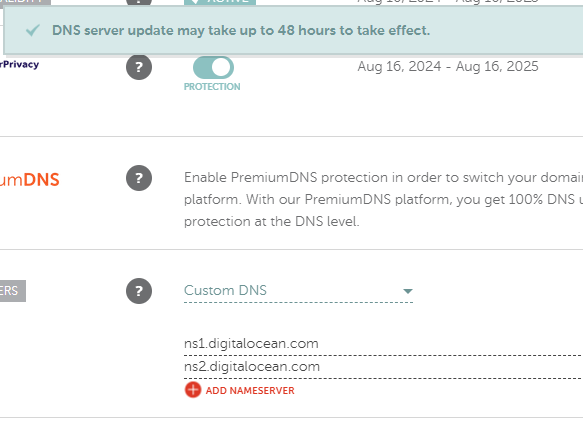

Shot from Namecheap to point NS records to DigitalOcean

DNS Checker verifying the transfer of NS records over to `DigitalOcean`.

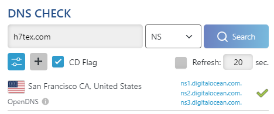

DNS Checker verifies the transfer of ownership over to DigitalOcean

The plan is to host about multiple sub-domains serving different purposes. 

```
info.h7tex.com - CTF Info + Registration
ctf.h7tex.com - CTF Infra
challs.h7tex.com - Challenge Server
h7tex.com - Guild
```

Also, there has been another major change in the proceedings of the CTF, Centinals also had their event postponed, to late September. Now, we decided to make a collaboration with Centinals to conduct a CTF Onsite + Online. It’s again being called `H7CTF`, LOL back to the start. Anyways, It’s great to see a collaboration. About sponsorships, we hope that `OffSec` will sponsor the event, we’ve been talking for quite a while now, also while actively searching for other options as well. Maybe some to offer cash prize sponsor, that would be so cool. 

Original plan, before the collaboration, was actually to use `CTFd` as the hosting provider, as we’ll have a limit of 500 users and had to pay about 1.6k INR, which is bit expensive but manageable, turns out, it’s actually 5K INR or $60, after the 80 percent discount for educational institutions. So we jumped out of it. Now, we’ll focus more on challenge creation and full on start the work. One slight hiccup was, as soon as I joined DigitalOcean [$1 for verifying, refunded instantly] I didn’t receive the credits, I was like so done with this cloud. Then I made a ticked to the them, I got it almost instantly.


As for Indian readers, looking to go about this process, I would suggest `HDFC`, which solves this International Transactions and also most importantly enabling the recurrent payment mode quite well with their Visa Debit card. 

Here’s me playing with the VPS, this is the second day in my life that I interacted with a VPS, this is so cool. LOL.

Here’s some basic details for self-referencing.

```
Concepts:

Virtual Hosts
FHS
Internet Corporation for Assigned Names and Numbers (ICANN)

```

**`/var/www/`**: This is the default directory where web server files are stored. This convention is based on the Filesystem Hierarchy Standard (FHS), which helps maintain consistency across different Linux distributions.
`/var/www/info.h7tex.com/html/`

Each directory serves as the document root for different subdomains or sites, making it easier to manage multiple websites on the same server.

<aside>
💡 A virtual host is **a configuration that allows a single host machine to act as multiple host machines**. It can be used to manage a single application server on a single machine as if it were multiple application servers, each on its own host machine. Virtual hosts can also be used to host multiple domains or sites from a single IP address or interface.

</aside>

These virtual files will be stored in the respective web servers configuration directories, for `Nginx`, it’s `/etc/nginx/sites-available` and it’s symbolically linked to `sites-enabled` in the same directory for production. These files mention the basic information for the web server to configure.

- **`listen 80;`**: Tells Nginx to listen on port 80 (HTTP).
- **`server_name info.h7tex.com;`**: Specifies the domain name or subdomain.
- **`root /var/www/info.h7tex.com/html;`**: Points to the document root for this subdomain.
- **Logs**: Separate access and error logs for easier troubleshooting.

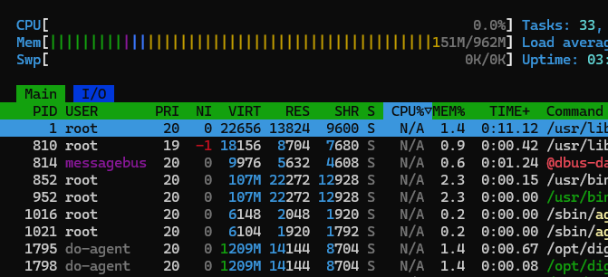

```bash
abu@Abuntu:/$ sudo certbot --nginx -d info.h7tex.com
<>
Deploying certificate
Successfully deployed certificate for info.h7tex.com to /etc/nginx/sites-enabled/info.h7tex.com
Congratulations! You have successfully enabled HTTPS on https://info.h7tex.com

sudo certbot certificates
sudo certbot renew --dry-run
scp -r <>/CTFTemplate/ root@<>:/var/www/info.h7tex.com/html/
```

Also added SSL certificates with `Let’s Encrypt` and `Certbot`.

<aside>
💡 Let's Encrypt is a free, automated, and open certificate authority that provides SSL/TLS certificates to enable HTTPS encryption on websites. It simplifies the process of obtaining and installing security certificates, making it easier for website owners to secure their site.

</aside>

Don’t forget the UFW firewall.

<aside>
💡 UFW (Uncomplicated Firewall) is a user-friendly interface for managing iptables, the default firewall management tool in Linux. It provides a simplified way to configure and control network traffic, enhancing system security by allowing or blocking incoming and outgoing connections.

</aside>

```bash
sudo ufw enable
sudo ufw allow OpenSSH
sudo ufw allow 'Nginx Full'
sudo ufw status
```

Now, let’s configure CTFd with Docker, now this is going to be a long process. Refer the documentation at the link below.

[CTFd Docs](https://docs.ctfd.io/)

Also, install Docker and Docker-Compose.

[Docker Home](https://docs.docker.com/)

```bash
abu@Abuntu:~$ docker --version
Docker version 27.1.2, build d01f264
abu@Abuntu:~$ docker compose version
Docker Compose version v2.29.1
```

Install `Redis` , which is a Caching-Server heavily used by CTFd.

```bash
sudo apt install redis-server -y
abu@Abuntu:~$ sudo systemctl status redis
● redis-server.service - Advanced key-value store
     Loaded: loaded (/usr/lib/systemd/system/redis-server.service; enabled; preset: enabled)
     Active: active (running) since Sat 2024-08-24 09:03:24 UTC; 10s ago
       Docs: http://redis.io/documentation,
             man:redis-server(1)
   Main PID: 23136 (redis-server)
     Status: "Ready to accept connections"
```

At first, I tried to run both the instances, namely [info.h7tex.com](http://info.h7tex.com) and [ctf.h7tex.com](http://ctf.h7tex.com) from the same droplet, but it has some port interference issues, cause since the CTFd runs in a Docker container, there’s an Nginx, that’s internal which collides with the local Nginx. So, I just moved everything over to a new droplet. 

```bash
sudo docker compose up -d
```

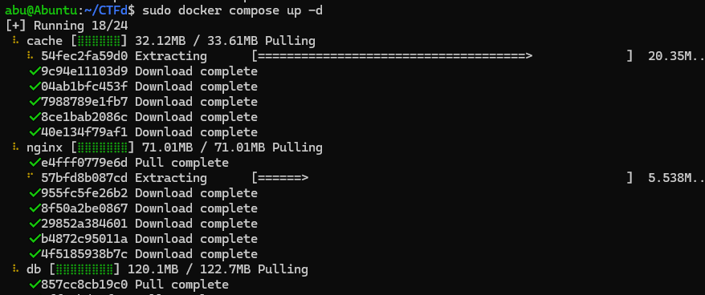

Still a lot of things to consider, but for once, everything went well, Happy.

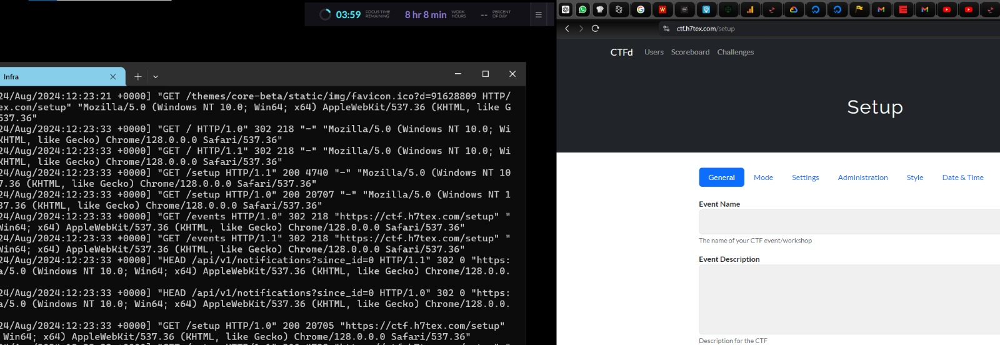

Hosting and getting familiar with the CTFd platform. Experimented with different themes and all that interesting stuff.

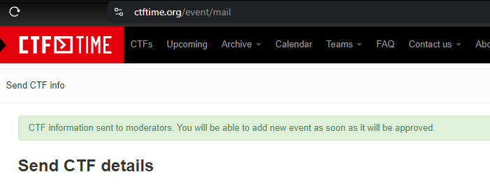

Here’s me sending the event detail to the CTFTime moderators to get it approved.


Took the free-tier in `CloudFlare` and shifted the whole NS server over there, which was one the best decision.


After the initial setup, which is rather pretty straight-forward, we get active status. And you can add all your DNS records and do a lot of cool stuff.

```bash
PS C:\Users\Abu> ipconfig /flushdns                                                                                     
Windows IP Configuration

Successfully flushed the DNS Resolver Cache.
```

Site is back up again. [FUTURE] As of now, I don’t remember the exact reasons I put this here, but I’ll just leave it as it is LOL.

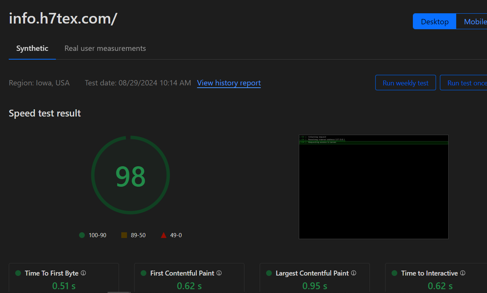

We need to think about database server, by default it runs on SQLite, which handles all the file uploads, score-boards and other data. but does not support real-time database monitoring. 

[Installation | CTFd Docs](https://docs.ctfd.io/docs/deployment/installation#database-server)

The docker container has a persistent volumes running even when the container is stopped or destroyed, we could use DB Browser for SQLite, an open-source tool for monitoring data traffic.

[DB Browser for SQLite](https://sqlitebrowser.org/)


But wait, real-time monitoring for a database ? I don’t actually need it right, cause we control the file uploads and score-board monitoring can we done just by looking at the site LOL.

Here’s a small change for better security.

```bash
chown -R www-data:www-data /var/www/info.h7tex.com/html/dist
```

This setup ensures that files are readable by the web server and users but not writable, which helps maintain security.

As for the data stored in CTFd, it uses the MariaDB database, and induces a persistent volume on the VPS, so even if the docker container was down for a moment, and back up again all the data including the scoreboard, challenges solved and all other details would be retained.

```bash
volumes:
      - .data/CTFd/logs:/var/log/CTFd
      - .data/CTFd/uploads:/var/uploads
      - .:/opt/CTFd:ro
```

### Enlightenment

At long long last, the site is finally ready !

[H7CTF International](https://ctf.h7tex.com/)

We also added in a new theme. Shout-Out to [`0xdevsachin`](https://github.com/0xdevsachin) for the cool theme.

```bash
	cd /CTFd/CTFd/theme
	git clone https://github.com/0xdevsachin/CTFD-crimson-theme.git crimson
```

Then start the docker container and while setting up the page, you can select the theme from the drop-down menu. P.S. the docker container terminal doesn’t seem to be writeable so the work-around. Now we going on a triple city `industrial visit` as part of our university. Peace.

Back from the IV, it was fantastic FR.

Now, we have some really cool news.


I was riding my bike when I saw this, instantly started fist bumping in the air. Happy. Was trying this for a while, now when I presented the sponsors and the prizes in a much detailed manner, it just took a day for it to be verified.

```bash
Prize Distribution for H7CTF International
Prize Pool: 156,000 INR or $1900

Online Prizes:
1st Place Online:

1x Learn Fundamentals subscription ($799 or 67,000 INR)
1 CRTP voucher ($249 or 21,000 INR)
3x .xyz domains ($30 or 2,500 INR)
Certificate of Excellence
Total Value: 90,500 INR or $1,100

2nd Place Online:

1x Annual PG Subscription ($200 or 16,800 INR)
2x .xyz domains ($20 or 1,700 INR)
Certificate of Excellence
Total Value: 18,500 INR or $220

3rd Place Online:

2x .xyz domains ($20 or 1,700 INR)
Certificate of Excellence
Total Value: 1,700 INR or $20

Onsite Prizes:
1st Place Onsite:

1 CRTP voucher ($249 or 21,000 INR)
3x .xyz domains ($30 or 2,500 INR)
Certificate of Excellence
Total Value: 59,100 INR or $700

2nd Place Onsite:

1x Annual PG Subscription ($200 or 16,800 INR)
2x .xyz domains ($20 or 1,700 INR)
Certificate of Excellence
Total Value: 18,500 INR or $220

3rd Place Onsite:

2x .xyz domains ($20 or 1,700 INR)
Certificate of Excellence
Total Value: 1,700 INR or $20

Additional Prizes:
Top 15 Teams (Online & Onsite):
Certificate of Excellence
All Participants:
Participation Certificates
Best Writeup:
1x .xyz domain (840 INR or $10)
```

Looks pretty cool HAHA. Also we also have a financial sponsorship from Altered Security for the onsite event management, really cool after I presented them with a cool proposal that would put them on open screens around the campus. All things look cool, now all that’s left is that of testing server security to the core and creating cool challenges !


Now, after the initial approval from CTFTime, we need to enter the more detailed version of the event with all the details that will be available to the public and wait for another approval for it to be publicly available.


And then it came, about a week away from the event.


So happy and nervous HAHA.

We move on.


I enabled this on Cloud-Flare and it’s a sweet thing, you see that Cloud-Flare comes out with the interstitial page before loading up the site, and it helps a lot. Sorry to all the participants for things, I know it can be annoying, but there's only so much I can do with limited resources at hand.

`Bot Protection`

`Reduced Load on Server`

`Improved Security Posture`


Hosting challenges in `CTFd`. Shout-out to them, they made it free and so easy to use with documentation.

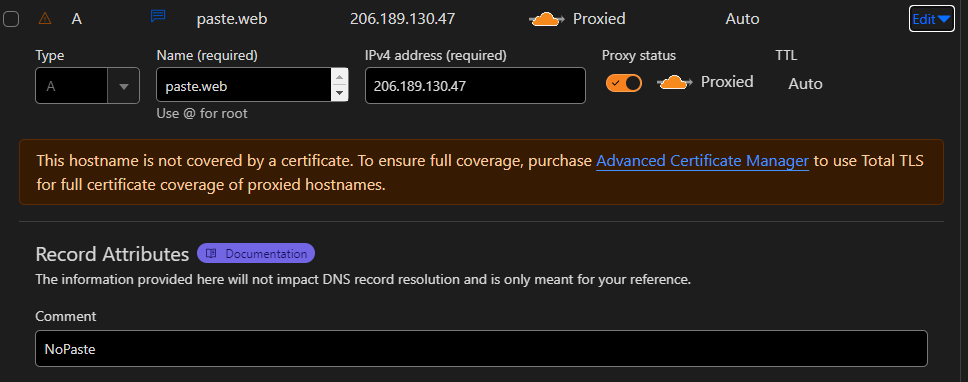

Oh yea, this happened because `cloudflare` only covered sites with a single-level subdomain, like we were going for `paste.web.h7tex.com` but since it was no good, we shifted to `paste.h7tex.com` .

```bash
root@Web:/home/night/web/chall-2# docker compose up -d
WARN[0000] /home/night/web/chall-2/docker-compose.yml: the attribute `version` is obsolete, it will be ignored, please remove it to avoid potential confusion
[+] Running 7/7
 ✔ Container Paste-abu              Started                                                                   0.8s
 ✔ Container chall-2-newspaper-1-1  Started                                                                   0.8s
 ✔ Container chall-2-newspaper-2-1  Started                                                                   0.7s
 ✔ Container chall-2-get-admin-1    Started                                                                   0.7s
 ✔ Container mongo                  Started                                                                   0.8s
 ✔ Container backend                Started                                                                   1.5s
 ✔ Container chall-2-frontend-1     Started                                                                   2.1s
root@Web:/home/night/web/chall-2# docker ps
CONTAINER ID   IMAGE                 COMMAND                  CREATED         STATUS          PORTS
                                 NAMES
7650d379a5ce   chall-2-backend       "docker-entrypoint.s…"   3 minutes ago   Up 9 seconds    0.0.0.0:5000->5000/tcp, :::5000->5000/tcp             backend
db043966607f   chall-2-frontend      "/docker-entrypoint.…"   9 minutes ago   Up 8 seconds    0.0.0.0:3000->80/tcp, [::]:3000->80/tcp               chall-2-frontend-1
846eee31a127   chall-2-get-admin     "python app.py"          9 minutes ago   Up 10 seconds   5000/tcp, 0.0.0.0:5001->5001/tcp, :::5001->5001/tcp   chall-2-get-admin-1
e823899cfece   chall-2-paste         "docker-entrypoint.s…"   9 minutes ago   Up 10 seconds   0.0.0.0:2222->2222/tcp, :::2222->2222/tcp             Paste-abu
e8290c8acbd9   chall-2-newspaper-1   "docker-php-entrypoi…"   9 minutes ago   Up 10 seconds   0.0.0.0:8081->80/tcp, [::]:8081->80/tcp               chall-2-newspaper-1-1
72688fed1515   chall-2-newspaper-2   "docker-php-entrypoi…"   9 minutes ago   Up 10 seconds   0.0.0.0:8082->80/tcp, [::]:8082->80/tcp               chall-2-newspaper-2-1
d12b58b0bfdf   mongo:latest          "docker-entrypoint.s…"   9 minutes ago   Up 10 seconds   0.0.0.0:27017->27017/tcp, :::27017->27017/tcp         mongo
```

This is how we put our web challenges grouped together with docker-compose, which is so easily managed. So here’s the outlook on the working of the model, we had a single droplet with the following specs.

```bash
4 vCPUs
8GB / 25GB Disk
($84/mo)

By the way, this was the specs at the end of the CTF, at first we had about 4 GB assigned.
We up-scaled.
```

Used `Nginx` as a reverse proxy to the VPS, that would connect with the docker-compose and assign the different subdomains for different challenge ports and those guys would be running. By default, without them subdomains, we could have hosted these challenges like `<IP>:PORT` and after pointing the A records to the IP address of the droplet, we use Nginx to forward them ports to their appropriate subdomains.

`<IP1>:PORT1 → newsleaks.h7tex.com`

`<IP2>:PORT2 → paste.h7tex.com`

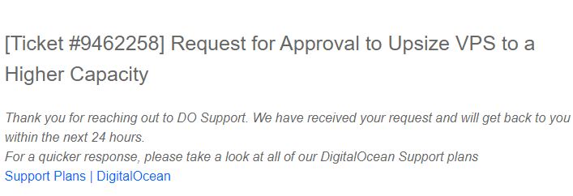

Well we got rejected on that one, turns out we need a history of previous payments in order to do that, and all we had now was a 8GB RAM with 4 vCPUs to serve to about 2000 hackers. Damn.

https://github.com/HeroCTF/CTFd-scoreboard-CTFtime

Here’s a script for people to convert the scoreboard CSV exported from the CTFd into JSON. Cause that is the method to input scores into CTFTime.

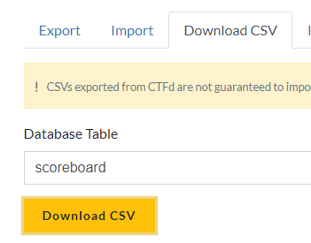

But, it’s all clobbered together. Use this to beautify the JSON.

[Best JSON Formatter and JSON Validator: Online JSON Formatter](https://jsonformatter.org/)

Here’s the CTFTime rules for the scoreboard feed.

[CTFtime.org / Scoreboard feed](https://ctftime.org/json-scoreboard-feed)

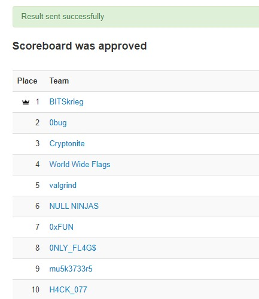

Hello again, here again after the event. So happy with the way things played out. 

```bash
Abuntu (s-1vcpu-1gb)
648 hours
$5.79
Abuntu (c-4-8GiB)
76 hours
$9.50
Abuntu (c-4-8GiB)
53 hours
$6.63
Web (c-4-8GiB)
13 hours
$1.63
Abuntu (s-1vcpu-1gb-35gb-intel)
54 hours
$0.64
Abuntu (s-1vcpu-1gb)
3 hours
$0.03
Abuntu (s-1vcpu-1gb)
513 hours
$4.58
Abuntu (c-4-8GiB)
$0.13
Web (c-2-4GiB)
78 hours
$4.88
Subtotal
$33.81

Credits
-$33.81
Total
$0.00
```

All this hosting, and it took just $38. Really impressed with Digital Ocean and the quality of their servers.  I thought it would be cutting it close. But wow.


Now, that I’m going around after the event ended, `CloudFlare` has also done a terrific job of mitigating and done the work behind the scene that really made it possible.

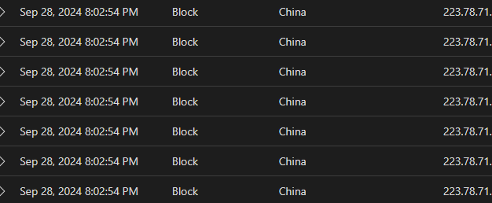

We also get to the cool analytics like this one.

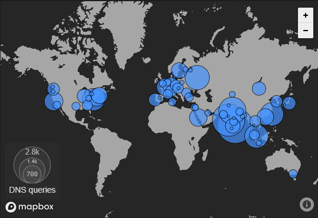

Wait.

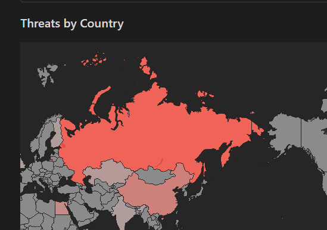

I’ll be damned. Don’t know about their reliability but sure all hell look cool to see. There were couple of incidents during the CTF, but during the end, someone was brute-forcing one of the challenges, and we really didn’t have much of an idea on how to mitigate this, and it hit me to try out `fail2ban` on the challenge server, and after `N1sh` did it, boom. IP blocked. Only obstacle was at the start when I hadn’t disabled the verify emails feature and everyone had to wait for about 15 minutes to solve this issue.

As for the `Pwn` challenges it was fully `Josh` doing the work. Unfortunately, something broke during the second pwn challenge, and we were unable to find the cause. So, we were forced to stop with just 2 challenges, which was really a bummer. Here’s the `docker-compose.yml`

```
services:
  piebypass:
    image: h7tex/piebypass
    ports:
      - target: 5001
        published: 1338
        protocol: tcp
        mode: host

  ret2win:
    image: h7text/ret2win
    ports:
      - target: 5000
        published: 49001
        protocol: tcp
        mode: host

  heap:
    image: h7text/heap
    ports:
      - target: 1338
        published: 3881
        protocol: tcp
        mode: host

  formatstring:
    image: h7tex/formatstrings
    ports:
      - target: 5002
        published: 30001
        protocol: tcp
        mode: host
```

And here is the `Dockerfile` of the problematic `ret2win` challenge.

```
FROM ubuntu as base

RUN apt-get update && apt-get install -y gcc
COPY . .

RUN apt-get install nasm

RUN chmod +x compile-script.sh
RUN ./compile-script.sh
RUN apt-get install -y socat
RUN chmod +x main

FROM base

RUN groupadd -g 1001 pwnuser && useradd -r -u 1001 -g pwnuser pwnuser
USER pwnuser

CMD socat tcp-l:5000,reuseaddr,fork EXEC:"./main",pty,stderr
```

Next time, we hope to make it so much better and interesting. Both Infrastructure and Challenges-wise. I also know that this was a pretty not so well-organized blog, but it was fun writing this up. Until next time, Peace. 

I thank all the organizers for their wonderful contributions in the event. You guys are the best !

Let’s roll out the credits.

`Credits`

```
N1sh
PattuSai
MrGhost
SHL
Rohmat
Josh
Ronnie
Zeta
ctfguy
Tourpran
Daniboi
Atman
Zaki
Team Centinals
BeefBrain
```

## Resources

[How to Dockerize a MERN App | Docker Compose](https://www.youtube.com/watch?v=J2dB96MUL8s)

[Choosing the best Node.js Docker image | Snyk](https://snyk.io/blog/choosing-the-best-node-js-docker-image/)

[Install Docker Engine](https://docs.docker.com/engine/install/)

[100+ Docker Concepts you Need to Know](https://www.youtube.com/watch?v=rIrNIzy6U_g)

[Google Cloud Platform Website Hosting | How To Host Website On Google Cloud | Simplilearn](https://www.youtube.com/watch?v=YHq8SWAkzG8&t=50s)

[Apache Virtual Host documentation - Apache HTTP Server Version 2.4](https://httpd.apache.org/docs/2.4/vhosts/)

For Further Reference:

[How to run a CTF that survives the first 5 minutes](https://medium.com/@sam.calamos/how-to-run-a-ctf-that-survives-the-first-5-minutes-fded87d26d53)

[Creating Scalable CTF Infrastructure on Google Cloud Platform with Kubernetes and App Engine](https://medium.com/@sam.calamos/creating-scalable-ctf-infrastructure-on-google-cloud-platform-with-kubernetes-and-app-engine-8c0a7847a53c)

[Using Kubernetes + HaProxy to Host Scalable CTF challenges](https://medium.com/csictf/using-kubernetes-haproxy-to-host-scalable-ctf-challenges-a4720b6a9bbc)

[CTF challenges: Dockerizing and Repository structure](https://medium.com/techloop/ctf-challenges-dockerizing-and-repository-structure-bd3aed9314de)

[Hosting CTF challenges on a Kubernetes cluster](https://medium.com/techloop/hosting-ctf-challenges-on-a-kubernetes-cluster-f0f7441c3cd0)

[Composing CTF challenge](https://medium.com/techloop/composing-ctf-challenge-b5828dba0feb)

[Infra overview and planning:  IEEECTF 2020](https://medium.com/techloop/infra-overview-and-planning-ieeectf-2020-555589505848)