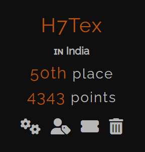
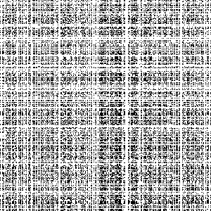
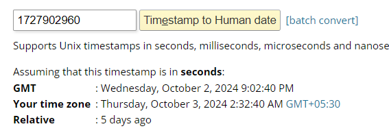
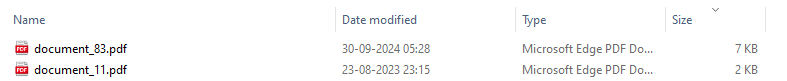
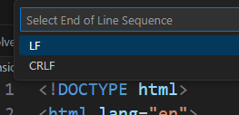
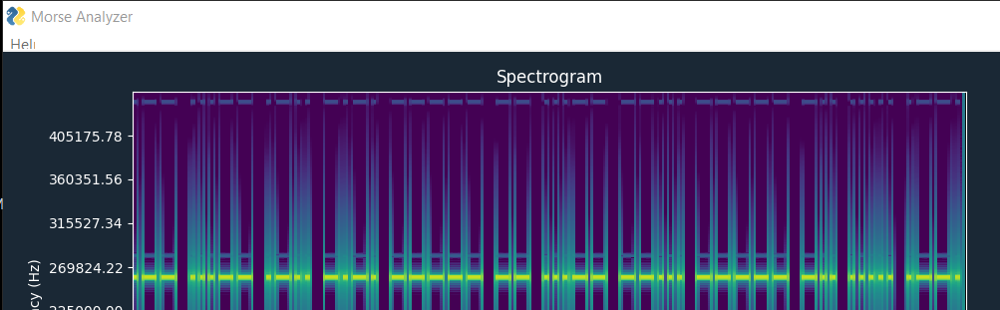
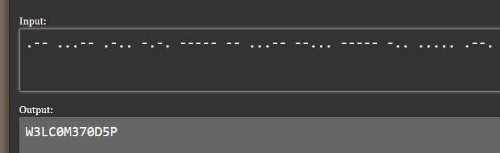
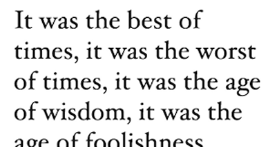
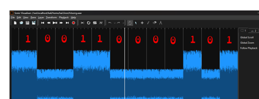

Hello CTFers. This was another great CTF conducted by a accomplice of mine. `Team 1nf1n1ty` conducted a banger of a CTF, that had great challenges amongst others. We, `H7Tex` placed 50th out of 1033 teams. Even though, I couldn’t contribute much during CTF as I was travelling, l hope to make write-ups for almost all challenges.




```bash
Players: Abu, PattuSai, N1sh, MrGhost
```

## Forensics

### **Random Pixels**

My Image accidently fell into a pixel mixer can you help me recover it?

**Author:** `OwlH4x`

Given: `chal.zip`

```bash
└─$ unzip chal.zip
Archive:  chal.zip
  inflating: enc.py
  inflating: encrypted.png
```

Unzipping the zip, we get 2 files.

```bash
import random, time, numpy
from PIL import Image
from secret import FLAG

def randomize(img, seed):
        random.seed(seed)
        new_y = list(range(img.shape[0]))
        new_x = list(range(img.shape[1]))
        random.shuffle(new_y)
        random.shuffle(new_x)

        new = numpy.empty_like(img)
        for i, y in enumerate(new_y):
                for j, x in enumerate(new_x):
                        new[i][j] = img[y][x]
        return numpy.array(new)

if __name__ == "__main__":
        with Image.open(FLAG) as f:
                img = numpy.array(f)
                out = randomize(img, int(time.time()))
                image = Image.fromarray(out)
                image.save("encrypted.png")
```



At first glance this seems like the PNG file has been scrambled with the `randomize()` function. In depth, what happens is, the code scrambles an image using a pseudo-random number generator (PRNG) seeded by the current UNIX timestamp using `int(time.time())`. The image is randomized by shuffling its pixel positions, which makes the output look like random noise. However, this method is vulnerable because the seed used for shuffling is based on the UNIX timestamp, which can be recovered using metadata.
Also, when we look at the encryption script, 

- The image is loaded and its pixels are scrambled based on two lists (`new_x` and `new_y`) generated by shuffling the x and y coordinates.
- The shuffle is deterministic as it relies on `random.seed(seed)`. Therefore, if you know the seed, you can reverse the process by performing the same shuffle in reverse.

Cool thing is that, we can find the seed of the image by looking at the times of the encrypted PNG, from `exiftool`. I did a similar challenge for H7CTF, this is cool to see.

```bash
└─$ exiftool encrypted.png
ExifTool Version Number         : 12.76
File Name                       : encrypted.png
Directory                       : .
File Size                       : 22 kB
File Modification Date/Time     : 2024:10:03 02:32:40+05:30
File Access Date/Time           : 2024:10:07 17:28:41+05:30
File Inode Change Date/Time     : 2024:10:07 17:17:22+05:30
File Permissions                : -rwxrwxrwx
File Type                       : PNG
File Type Extension             : png
MIME Type                       : image/png
Image Width                     : 300
Image Height                    : 300
Bit Depth                       : 8
Color Type                      : RGB with Alpha
Compression                     : Deflate/Inflate
Filter                          : Adaptive
Interlace                       : Noninterlaced
Image Size                      : 300x300
Megapixels                      : 0.090
```

Let’s take the time from `File Modification Date/Time`which is `2024:10:03 02:32:40+05:30`[+5:30 is not required, as it’s just giving it in IST], as it mentions the time when the image was modified, so a good place to start. Convert the date to a timestamp with some online epoch convertor tool as follows.

[Epoch Converter](https://www.epochconverter.com/)



Therefore, the UNIX timestamp at hand is `1727902960`, using that as the seed to reverse the process. 

```bash
import random, numpy
from PIL import Image

def randomize(img, seed):
    random.seed(seed)

    orig_y = list(range(img.shape[0]))
    orig_x = list(range(img.shape[1]))
    random.shuffle(orig_y)
    random.shuffle(orig_x)

    original = numpy.empty_like(img)

    for i, y in enumerate(orig_y):
        for j, x in enumerate(orig_x):
            original[y][x] = img[i][j]

    return original

if __name__ == "__main__":

    path = "encrypted.png"
    encImage = Image.open(path)
    encArray = numpy.array(encImage)

    seed = 1727902960
    
    revImageArray = randomize(encArray, seed)
    revImage = Image.fromarray(revImageArray)
    revImage.save("flag.png")
    print("Process Done!")
```

After running, the script we get a QR! Then we use a tool called `zbarimg`, which scans and decodes bar codes from image file right in the CLI.

```bash
└─$ zbarimg flag.png
QR-Code:ironCTF{p53ud0_r4nd0m_f0r_4_r3450n}
scanned 1 barcode symbols from 1 images in 0.04 seconds
```

Flag: `ironCTF{p53ud0_r4nd0m_f0r_4_r3450n}`

### **Game of Hunt**

A Cryptic Voyage

**Author**: `tasarmays`

Given: `upsidedown.txt`

We are given a huge binary file, opening it in `cyberchef`, and decrypting it from binary, we see it makes somewhat of like a directory listing, and further converting it to hex [I found this after some trial and error], we see the last section of the data end with, `04 03 4b 50`, which is the reverse of a zip file format. 


When we try to unzip the file, it gives out an error.

```bash
└─$ unzip download.zip
Archive:  download.zip
error [download.zip]:  missing 20957899 bytes in zipfile
  (attempting to process anyway)
error [download.zip]:  start of central directory not found;
  zipfile corrupt.
  (please check that you have transferred or created the zipfile in the
  appropriate BINARY mode and that you have compiled UnZip properly)
```

using `—fixfix` tag to try and fix the file.

```bash
└─$ zip --fixfix download.zip --out fixed.zip
Fix archive (-FF) - salvage what can
 Found end record (EOCDR) - says expect single disk archive
Scanning for entries...
 copying:   (0 bytes)
 copying:   (3273347146 bytes)
```

But this didn’t work as well, and I was stuck here for a while, until I switched the mode to bytes from character in reverse, cause character reversing usually takes place in a text file, for files reversing, bytes is more common. After unzipping, we find a lot of PDF files, and sorting by size, we see a PDF with a different size [7 KB].



Then, we extract the text from the PDF. We notice that it’s `BrainFuck`.

```bash
└─$ pdf2txt download/ilovepdfs/document_83.pdf > output.txt

┌──(abu㉿Abuntu)-[/mnt/c/Documents4/CyberSec/ironCTF/forensics/gameHunt]
└─$ cat output.txt
How do you feel now, find the hidden esolang :)

++++++++++[>+>+++>+++++++>++++++++++<<<<-]>>>>+++++.++++++++
+.---.-.<---.+++++++++++++++++.--------------.>+++++++++++++.<+++++++++++++++++
++.>------------.+++++
+.<++++++.++.>---.<++++.------.>++.<+++++++++.---.------.+++++++.+
++.+++++.---------.>-.
+.+++++++++.
```

Decoding that we get the flag.

Flag: `ironCTF{You_are_the_finest}`

### **Uncrackable Zip**

I forgot to ask my friend for the password to access the secret webpage, and now he's unavailable. I've tried guessing the password, but it's been unsuccessful. My friend is very security-conscious, so he wouldn't use an easy-to-guess password. He's also an Emmet enthusiast who relies heavily on code generation shortcuts. Can you help me figure out how to access the secret webpage?

**Author**: `AbdulHaq`

Given: `website.zip`

Initially, you try to bruteforce the zip with all kinds of wordlists, to which the zip file doesn’t even budge. Then we read the description carefully, we see that the friend like `emmet`, which is a **toolkit for web-developers, that allow you to store and re-use commonly used code chunks.**

Reading the documentation and all that, even before that, we know that the HTML files start with the OG syntax, and since we know some starting bytes of the plaintext, we can implement a known-plaintext attack on the zip file. For this we can bring out a legendary tool called `bkcrack`.

[bkcrack](https://github.com/kimci86/bkcrack)

```bash
└─$ ./bkcrack -L website.zip
bkcrack 1.7.0 - 2024-05-26
Archive: website.zip
Index Encryption Compression CRC32    Uncompressed  Packed size Name
----- ---------- ----------- -------- ------------ ------------ ----------------
    0 ZipCrypto  Store       7a0a2e19          274          286 index.html
```

We see that it uses the `ZipCrypto` encryption and the `Store` compressions. Important things to note.

<aside>
💡

To run the attack, we must guess at least 12 bytes of plaintext. On average, the more plaintext we guess, the faster the attack will be.

</aside>

Now, we can create a duplicate `index.html` with about 12 bytes or more of a known plaintext, which we know from the hints in the description. 

[Emmet Cheat Sheet](https://docs.emmet.io/cheat-sheet/)

We use the following known plaintext.

```html
<!DOCTYPE html>
<html lang="en">
<head>
    <meta charset="UTF-8">
```

Also, here’s a guide on this that we can refer to.

[bkcrack](https://github.com/kimci86/bkcrack/blob/master/example/tutorial.md)

Now, we can zip this index.html file with the appropriate encryption and compression techniques, essentially, matching the one in the encrypted zip file.

```bash
zip -r -e -P "1" -0 index.zip index.html
```

This command creates a ZIP file (`index.zip`) containing the file `index.html`. The contents of `index.html` are not compressed [`Store`] (because of the `-0` flag) and are encrypted with the password `"1"` using **ZipCrypto**.

Had some issues in cracking the zip with the same procedure. Was stuck here for a while. Then while looking at the hex bytes of the plaintext `index.html`.

```html
└─$ xxd index.html
00000000: 3c21 444f 4354 5950 4520 6874 6d6c 3e0a  <!DOCTYPE html>.
00000010: 3c68 746d 6c20 6c61 6e67 3d22 656e 223e  <html lang="en">
00000020: 0a3c 6865 6164 3e0a 2020 2020 3c6d 6574  .<head>.    <met
00000030: 6120 6368 6172 7365 743d 2255 5446 2d38  a charset="UTF-8
00000040: 223e 0a
```

We can see that it uses the `LF` terminator. Now time for some googling.

<aside>
💡

Known-plaintext attacks (like the one used by `bkcrack`) rely on an exact match between the plaintext (known content) and the corresponding encrypted data in the ZIP file. If the line endings of your plaintext don't match those of the file stored in the ZIP archive, the attack will fail because the data won’t align byte-for-byte. When the file was originally created or zipped, it might have been generated on a Windows system or with tools that use CRLF for line terminators, meaning each line ends with `\r\n` rather than just `\n`. The ZIP file stores these line terminators as part of the file’s content, so your plaintext must have CRLF line endings to match what is in the encrypted ZIP file.

</aside>

Changing `LF` into `CRLF` [**Carriage Return and Line Feed**, which are special characters used to indicate the end of a line in text files and other software code] 

- **LF (`\n`, 0x0A)**: The Unix/Linux standard for line endings.
- **CRLF (`\r\n`, 0x0D 0x0A)**: The Windows standard for line endings.



```bash
└─$ ./bkcrack -L index.zip
bkcrack 1.7.0 - 2024-05-26
Archive: index.zip
Index Encryption Compression CRC32    Uncompressed  Packed size Name
----- ---------- ----------- -------- ------------ ------------ ----------------
    0 ZipCrypto  Store       97eb7647           67           79 index.html
```

Making sure, it’s all good in the encryption [`ZipCrypto`] and the compression [`Store`] parts. Now, we run again.

```html
└─$ ./bkcrack -C website.zip -c index.html -p index.html -U decrypt.zip 1
bkcrack 1.7.0 - 2024-05-26
[21:39:28] Z reduction using 64 bytes of known plaintext
100.0 % (64 / 64)
[21:39:28] Attack on 125771 Z values at index 6
Keys: a18ba181 a00857dd d953d80f
78.2 % (98325 / 125771)
Found a solution. Stopping.
You may resume the attack with the option: --continue-attack 98325
[21:45:11] Keys
a18ba181 a00857dd d953d80f
[21:45:11] Writing unlocked archive decrypt.zip with password "1"
100.0 % (1 / 1)
Wrote unlocked archive.
```

Yessir. Shout-out to `@Zukane` for helping me out on this.

```html
└─$ cat index.html
<!DOCTYPE html>
<html lang="en">
<head>
    <meta charset="UTF-8">
    <meta name="viewport" content="width=device-width, initial-scale=1.0">
    <title>Flag</title>
</head>
<body>
    ironCTF{Wh0_us35_Z1pCrypt0_wh3n_kn0wn_PlA1nt3xt_a7t4cks_ex1s7?}
</body>
</html>
```

Flag: `ironCTF{Wh0_us35_Z1pCrypt0_wh3n_kn0wn_PlA1nt3xt_a7t4cks_ex1s7?}`

### Air Message

what a noisy audio file, probably nothing useful... Wrap your flag in the format ironCTF{...}

**Author**: `OwlH4x`

Hint: The output file is a 8bit mono PCM wav file

Given: `out.wav`

At first glance, almost all would have figured out there was a `morse` hidden in the file. I used this tool that `@lans` recommended after the event.

[morse-analyzer](https://github.com/spaceymonk/morse-analyzer)

Running the `morse-analyzer.exe` on the file. It really did spit out the `morse` LOL.



Then, we just use a `morse` decoder to finish off the job. But really I think the indented method might be to clean up the WAV file, do some tweaking's on the pitch, hertz and whatnot. 



Flag: `ironCTF{W3LC0M370D5P}`

### **8-ball Game**

An 8-ball pool player has planned a strategy for the next three quarters match. I would like to know what the strategy is. Can you help me find out?

Given: [One Drive](https://1drv.ms/u/s!AjJTc9OQtSbRc6KlrEiowN8WZfA?e=a2VoE0)

We see a huge `disk.tar` file for about 990MB. Extracting that we get a `disk.001` file, which turns out to be a boot sector image.

```bash
└─$ file disk.001
disk.001: DOS/MBR boot sector, code offset 0x52+2, OEM-ID "NTFS    ", sectors/cluster 8, Media descriptor 0xf8, sectors/track 63, heads 255, hidden sectors 523479040, dos < 4.0 BootSector (0x80), FAT (1Y bit by descriptor); NTFS, sectors/track 63, sectors 2027519, $MFT start cluster 84480, $MFTMirror start cluster 2, bytes/RecordSegment 2^(-1*246), clusters/index block 1, serial number 08c108c72108c64d4; contains bootstrap BOOTMGR
```

Mounting the file we see lot of a loop holes to fall into.

```bash
sudo mount -o loop,ro disk.001 /mnt/8/
```

Now, I’ll refer `@q4say` - only person to blood and solve this challenge. Full credits to him.

Diving into `Documents\flag`, we see a lot of PNG pieces.

```bash
┌──(abu㉿Abuntu)-[/mnt/8/Documents/flag]
└─$ ls
'Drake m'          piece_14_40.png   piece_20_25.png   piece_25_1.png    piece_30_4.png    piece_35_36.png   piece_4_21.png
'Drake p'          piece_14_4.png    piece_20_26.png   piece_25_20.png   piece_30_5.png    piece_35_37.png   piece_4_22.png
 piece_10_10.png   piece_14_5.png    piece_20_27.png   piece_25_21.png   piece_30_6.png    piece_35_38.png   piece_4_23.png
 piece_10_11.png   piece_14_6.png    piece_20_28.png   piece_25_22.png   piece_30_7.png    piece_35_39.png   piece_4_24.png
 piece_10_12.png   piece_14_7.png    piece_20_29.png   piece_25_23.png   piece_30_8.png
```

Here’s a script written by `@q4say` to piece them all together.

```bash
 mkdir out
 for i in $(seq 1 40);
 do
    convert piece_{1..40}_${i}.png -append out/output_${i}.png
 done
cd out
 for i in $(seq 1 40);
 do
    convert output_${i}.png -rotate 90 r90/90_output_${i}.png
 done
 cd r90
 convert 90_output_{1..40}.png -append final.png
```



Seems like, this was another loop hole LOL.

Other one to note, is under `/Documents/fff`

```bash
┌──(abu㉿Abuntu)-[/mnt/8/Documents/fff]
└─$ cat flag\ description
flag is not here all the best try well check all the file don't take anything as silly. but i know he loved this "Let's set each other's lonely night, be each other's paradise" i don't know what it is may be key check all the possible
```

We see, it’s a Justin Bieber song, then we dive into `hitsong.wav`, there seems to a be a lot of highs and lows in the spectrogram of the audio file. Binary data.

Here is a still from `@q4say`'s write-up.



I have no idea, how he extracted the 0s and 1s. Seems hella confusing to me. Anyways here is the extracted binary data.

```bash
01101001011100100110111101101110010000110101010001
00011001111011011010010101111101100011011010000110
00010110110001101100011001010110111001100111011001
010101111101111001011011110111010101111101
```

Flag: `ironCTF{i_challenge_you}`


