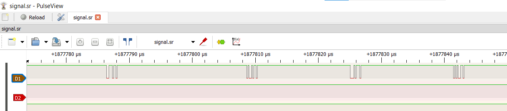

Even though I wasn’t able to attend this fantastic CTF, I’ll try my hand in solving these really well-crafted challenges. Props to the `Cryptonite` team and all the challenge creators.

```bash
Author: Abu
```

### Hardware


Starting-off with Hardware cause why not LOL.

You know the feeling when you’re put in a place, where you pretty much have no clue what was going on, that was me when doing these hardware challenges.


明日も続きます。

### **U ARe T Detective**

**Author(s)**: `vikaran`

**Description**: One of our Detective tapped a channel to intercept this signal but couldn't read it, HELP HIM

Given: `signal.sr`

As the challenge name suggests, it has something to do with UART.

💡 UART stands for **universal asynchronous receiver / transmitter** and is a simple, two-wire protocol for exchanging serial data.


Notice the peculiar `.sr` file format, googling that leads us to `Sigrok`. Another way is to extract the file and read the metadata inside.

```bash
[global]
sigrok version=0.6.0-git-b503d24

[device 1]
capturefile=logic-1
total probes=8
samplerate=16 MHz
total analog=0
probe1=D0
probe2=D1
probe3=D2
probe4=D3
probe5=D4
probe6=D5
probe7=D6
probe8=D7
unitsize=1
```

When installing `Sigrok`, faced this error.

```bash
Sigrok.Pulseview MSVCR100.dll missing error
```

[microsoft/winget-pkgs/issues/92844](https://github.com/microsoft/winget-pkgs/issues/92844)


That fixes the issue. Opening up the file in Sigrok Pulse Viewer.


We notice strange markings in the `D1` pane, on closer notice these look like bits.



Now, we look to find the baud rate of the channels.

💡 Baud rate is **the measure of the number of changes to the signal (per second) that propagate through a transmission medium**.

In order to find the baud rate, you need to find the time taken for the smallest bit, then reciprocal it to find the custom baud rate, which is then used for decoding the UART signal.

[Decode/Analyse the following UART signals](https://electronics.stackexchange.com/questions/501849/decode-analyse-the-following-uart-signals)

As I looked into the official write-up, which is extremely small, the intended way was to find the custom baud rate and try to UART decode it. but it’s easier to do this manually (at least for me).

We need to do a bit of reverse thinking in order to recognize the bits, as you can see, there are segments of these square waveforms throughout the D1 pane, and each segment can be considered as a byte, to split the byte into the individual bits, we count the number of samples in the entire byte and divide it by 9 (since the starting byte is also considered), when we count the number of samples (these are the dots you see across the segment), we count up to 27, dividing by 9, we get 3. Therefore, we represent every bit with 3 samples, I donno if it’s twisted logic, but it satisfies mine HAHA. 


In the first segment, we receive a byte code of `01110110` and since UART transmits data from LSB to MSB, we reverse the code, giving us an output of `01101110`.

```bash
└─$ python3
Python 3.12.7 (main, Nov  8 2024, 17:55:36) [GCC 14.2.0] on linux
Type "help", "copyright", "credits" or "license" for more information.
>>> binary = '01101110'
>>> decimal = int(binary, 2)
>>> ascii = chr(decimal)
>>> print(ascii)
n
```

That gives us the first character of the flag. Doing the same for all the segments.

```bash
>>> binary = ('01101110','01101001','01110100','01100101', '01111011','01101110','00110000','01101110','01011111','01110011','01110100','01100100','01011111','01100010','00110100','01110101','01100100','01011111','01110010','00110100','01110100','00110011','01110011','01011111','01100110','01110100', '01110111', '01111101')
>>> convert = [chr(int(b, 2)) for b in binary]
>>> ascii = ''.join(convert)
>>> print(ascii)
nite{n0n_std_b4ud_r4t3s_ftw}
```

Flag: `nite{n0n_std_b4ud_r4t3s_ftw}`


